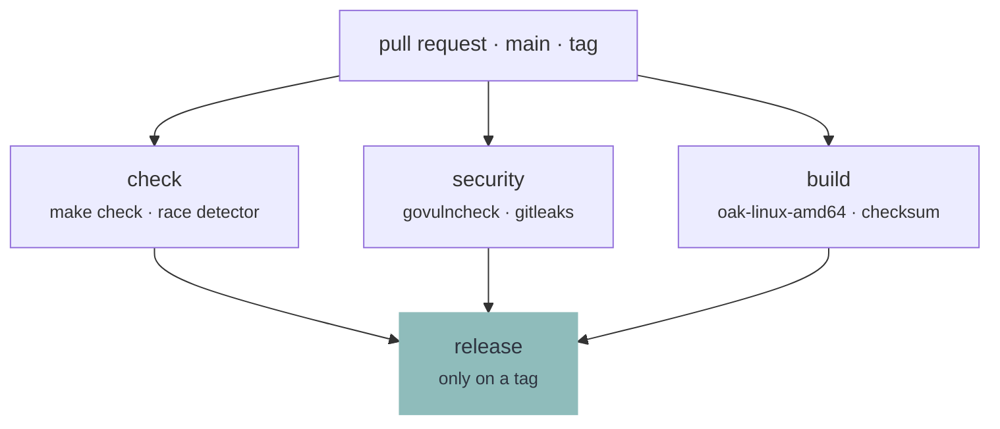

# Contributing

Oak is one binary and nothing else ships. Everything here follows from that: what is checked lives in the `Makefile`, CI runs the same commands, and a release is a tag on a commit those commands already passed.

## Branches

| Branch | Description |
| --- | --- |
| `feature/*` | Where work happens. Opened as a pull request, and checked there |
| `main` | What is released from. Merged into by pull request, squashed, so one change is one commit |

## What CI runs

Once per pull request, once per push to `main`, and once more on a tag.



| Job | Where | Description |
| --- | --- | --- |
| `check` | every run | `make check`, then the tests again under the race detector |
| `security` | every run | Vulnerabilities in what Oak imports, and a secret scan of the repository |
| `build` | every run | The binary and its checksum |
| `release` | a `v*` tag | Publishes the artefact the three above produced, signed |

`build` is the only job that compiles anything, and the release publishes that artefact rather than building again. What is downloaded is the file the checks ran against.

## Releasing

A release is a `v*` tag on `main`. The tag is what starts it, from either end:

```
git tag v1.2.0
git push origin v1.2.0
```

Or from the browser: **Releases** → **Draft a new release** → **Choose a tag**, type `v1.2.0`, **Create new tag on publish** → target `main` → **Publish release**.

Both land in the same place. A pushed tag has no release yet, so CI writes one with generated notes; a release published from the page already has its notes, so CI only hangs `oak-linux-amd64` and its checksum on it once the checks are green.

The version comes out of `git describe`, so the tag is what the binary answers with. Nothing else has to be edited.

**Note:** _The `v` is what CI watches for. A tag without it builds nothing and releases nothing._

**Note:** _Published from the page, the release is visible for the few minutes the run takes and has no binary on it yet. Tagging from a terminal shows it only once there is something to download._

**Note:** _Semantic versions. A change to what a product may declare is a minor version, a change that stops an existing product from loading is a major one._

## Doing the Work

```
make check                   # everything that has to pass before a commit
make run                     # Oak against the example product
make run MODULE=hello        # opens one module directly
make run ARGS=--debug        # ...without touching anything
make inspect                 # loads the example the way a run does
make locales                 # the template, and every catalog brought up to it
make release                 # bin/oak-linux-amd64, plus its checksum
```

Install the required packages:

```
sudo pacman -S --needed go gcc make shellcheck shfmt staticcheck yamllint actionlint gettext govulncheck gitleaks
```

**Note:** _CI installs the same packages and runs the same commands in an Arch container. There is no second definition of green._

## The Boundary

Oak draws, asks, keeps and runs. It knows nothing about what is being installed.

If a change would put the word `pacman`, `btrfs`, `GNOME` or `LUKS` anywhere in this repository, the change belongs in a product rather than here. Find the general capability a module is missing and add that instead.

**Note:** _Oak must not know a module by name either. `installer` and `recovery` are folder names in somebody's product, not words in this code._

## Words on Screen

Every sentence Oak shows is translatable and the English sentence is its own key, so writing one is writing the source text and the key at once. Reword it and the old translation is marked fuzzy rather than dropped.

```
make locales   # after adding, rewording or deleting anything on screen
```

**Note:** _`make check` refuses a stale template and a translation that has lost a placeholder._

## Commits

- Imperative mood (`Add`, `Fix`, `Refactor`), one logical change per commit
- Commits are squashed on merge, so the pull request title is what ends up in the history
