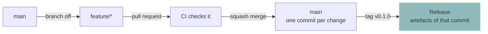
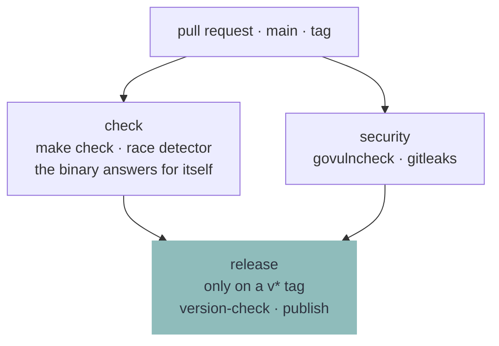

# Contributing

Oak is one binary and nothing else ships. What is checked lives in the `Makefile`, CI runs the same commands, and a release is a tag on a commit those commands already passed.

## Branches

There is one long-lived branch, `main`. Work happens on a branch off it and comes back through a pull request.



- Branch off `main`, name it `feature/<what>`
- Open a pull request. CI checks it
- **Merge with squash.** One pull request is one commit, so `main` stays a straight line and its title is what ends up in the history

**Repository settings this relies on** — Settings → General → Pull Requests:

| Setting | Value |
| --- | --- |
| Allow merge commits | off |
| Allow squash merging | on |
| Allow rebase merging | off |
| Require linear history (branch protection on `main`) | on |

## Releasing

A release is a `v*` tag on `main`. It publishes the artefacts of the commit it points at — nothing is rebuilt for it.

Which version is being released stands in **[the changelog](CHANGELOG.md)**: the section at the top is the one being worked towards, and its entries are what the release page will say. So the tag is read rather than typed:

```
make notes   # what the page will carry
make tag     # that version, tagged on HEAD and pushed
```

`make tag` prints the entries first, and refuses a version the changelog says nothing about or one that has already gone out — all of it before the tag exists, where a wrong name is a line in a terminal rather than a tag to delete off the remote.

It can also be drafted in the browser — **Releases** → **Draft a new release** → **Choose a tag**, **Create new tag on publish** → target `main`. The tag typed has to be the version the file opens on, or the run refuses to publish and the tag has to be deleted again.

Both land in the same place. Once the checks are green, CI hangs `oak-linux-amd64` on the release and writes the page out of the changelog — that version's entries, then the download and how to check where it came from. Notes typed into the browser form are replaced by them, and a run repeated on the same tag writes the page again, so what it says is what the file says. A version the changelog holds no section for stops the release before a download link exists.

What the binary answers is the tag `git describe` finds, without its `v`. The number itself is chosen once, in the heading `make tag` reads, and nothing else has to be edited to agree with it.

What that leaves is a tag pointing somewhere the build cannot follow — moved after the fact, or cut from a clone too shallow to describe one — and then a release would carry a version its own binary disagrees with. The last step before a download link exists refuses that: the tag has to read `vMAJOR.MINOR.PATCH`, and the binary about to be published under it has to answer to exactly that. `make tag` asks the first half. Ask the second half of a tag that already exists:

```
make build
make version-check TAG=v0.1.0
```

**Note:** _The `v` is what CI watches for. A tag without it builds nothing and releases nothing._

**Note:** _Semantic versions. What decides which number moves is the promise the [README](README.md#1-get-oak) makes to a product, so it is written down once, there._

## The changelog

**[CHANGELOG.md](CHANGELOG.md)** is kept as the work happens, not written at the tag. Open a section for the release being worked towards, and append one line per change under it:

```
## 0.4.0 - 2026-02-14

- A list too long for one screen opens a box that narrows it
```

- Newest first, `## X.Y.Z - YYYY-MM-DD`, one short line per change somebody building a product would notice
- The date is the day it goes out, so it is the one thing to look at again before tagging
- `make check` holds the shape, the order and that no version stands there twice
- Two **warnings** on the run and at the desk, never a refusal: work that landed with no section open for it, and a change that wrote nothing into the one that is — the lines may be written retrospectively, up to the tag
- A release does refuse: the section at the top is the version `make tag` writes, and the workflow stops on a tag with nothing under it

## What CI runs

Once per pull request, once per push to `main`, and once more on a tag.



`make check` builds the release artefact on its way through, so the binary the checks ran against is the binary uploaded, and the release publishes that file rather than building a second one. What is downloaded is what was checked, because there was only ever one of them.

## Doing the work

```
make check                   # everything that has to pass before a commit
make run                     # Oak against the example product
make run MODULE=setup        # opens one module directly
make run ARGS=--debug        # ...without touching anything
make inspect                 # loads the example the way a run does
make locales                 # the template, and every catalog brought up to it
make fmt                     # format the Go and the shell
make build                   # bin/oak-linux-amd64, the file a release publishes
make notes                   # what the next release page will say
make tag                     # that version, tagged and pushed
make version-check TAG=v0.1.0  # would that tag be allowed to release this?
```

Install the required packages:

```
sudo pacman -S --needed go gcc make shellcheck shfmt staticcheck yamllint actionlint gettext govulncheck gitleaks
```

**Note:** _CI installs the same packages and runs the same commands in an Arch container. There is no second definition of green._

## The boundary

Oak draws, asks, keeps and runs. It knows nothing about what is being installed.

If a change would put the word `pacman`, `btrfs`, `GNOME` or `LUKS` anywhere in this repository, the change belongs in a product rather than here. Find the general capability a module is missing and add that instead.

**Note:** _Oak must not know a module by name either. `installer` and `recovery` are folder names in somebody's product, not words in this code._

## Words on screen

Every sentence Oak shows is translatable and the English sentence is its own key, so writing one is writing the source text and the key at once. Reword it and the old translation is marked fuzzy rather than dropped.

```
make locales   # after adding, rewording or deleting anything on screen
```

**Note:** _`make check` refuses a stale template and a translation that has lost a placeholder._

## Pictures in the Docs

Every image under `docs/` is generated, so none of them can quietly outlive the interface it shows. The screenshots are taken from the example driven on a real terminal. The banner collages two of them under the wordmark, which is read out of `example/oak.yaml` rather than redrawn.

```
make screenshots   # after any visible change to a page
make banner        # after the screenshots, the wordmark or the accent changed
make docs          # both, in that order
```

They need `chromium`, `imagemagick`, `python-pyte` and `python-yaml`, none of which a build or `make check` needs.

Every run is started with `--debug`, so the example builds nothing while it is photographed. Which pages are taken is `docs/screenshots.yaml`; `screenshots.py` beside it is the same file in every project that renders a set this way.

**Note:** _Every page comes out byte for byte the same on every run except `run.png`, which catches the run while it is still going. Which task that frame lands on is a race against four tasks that take no time, so that one picture differs run to run._

## Commits

- Imperative mood (`Add`, `Fix`, `Refactor`), one logical change per commit
- Commits are squashed on merge, so the pull request title is what ends up in the history
