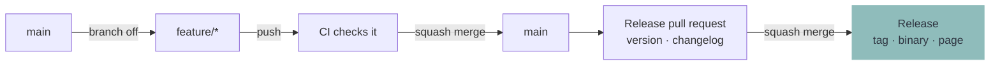
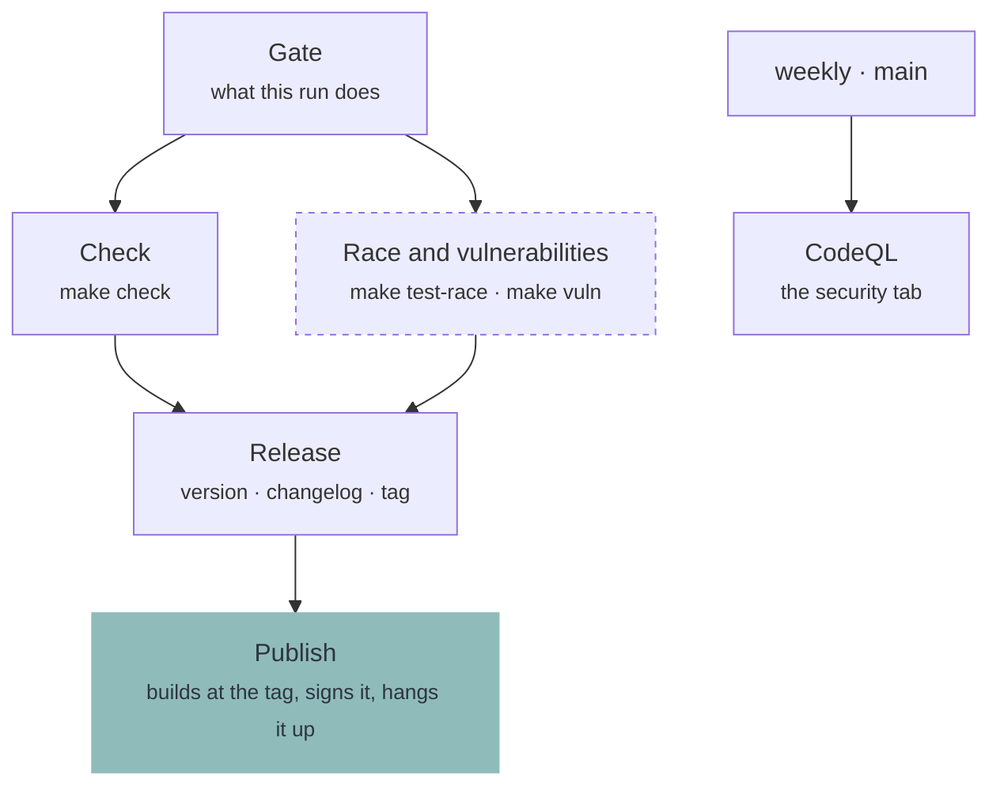

# Contributing

Oak is one binary and nothing else ships. What is checked lives in the `Makefile`, CI runs the same commands, and a release is a tag on a commit those commands already passed.

## Branches

There is one long-lived branch, `main`. Work happens on a branch off it and comes back through a pull request.



- Branch off `main`, name it `feature/<what>`
- Every push to it is checked, with or without a pull request open. Open one as a draft while there is nothing to read yet; leaving draft is what adds the race detector and the vulnerability scan
- **Merge with squash.** One pull request is one commit, so `main` stays a straight line - and its title is the line the next version and the changelog are read out of

**Note:** _A commit is under one run and never two: while a pull request is open, a push to its branch is left to the run that pull request already has._

**Repository settings this relies on:**

| Where | Setting | Value |
| --- | --- | --- |
| General → Pull Requests | Allow merge commits | off |
| General → Pull Requests | Allow squash merging | on |
| General → Pull Requests | Allow rebase merging | off |
| Branch protection on `main` | Require linear history | on |
| Actions → General | Allow GitHub Actions to create and approve pull requests | on |

## The Title

The title of a pull request is read by a machine, so it is written for one - [Conventional Commits](https://www.conventionalcommits.org): a type, a colon, and what changed.

| A title that reads | Does |
| --- | --- |
| `fix: a secret the machine already has is asked once` | 0.5.0 → 0.5.1, on the page under **Bug Fixes** |
| `feat: a product may say where the rest of it is` | 0.5.0 → 0.6.0, under **Features** |
| `feat!: a module declares its hooks by folder` | 0.5.0 → 0.6.0, and says on the page what to do about it |
| `docs:` `refactor:` `test:` `build:` `ci:` `chore:` | Nothing. Work nobody building a product would notice |

- `!` marks a change a product has to be edited for; the reason goes in the body as `BREAKING CHANGE: …`
- A check of its own refuses a title that opens on no type, because a title nothing can read releases nothing. It is the one check that reads the title again when it is corrected - everything else waits for a commit
- Below 1.0.0 a break moves the minor rather than the major - 1.0.0 is a decision, not a count

## Releasing

Two merges, both of them ordinary, and nothing typed:

1. **Squash merge the work into `main`.** The run checks it and opens - or updates - a pull request called `chore(main): release 0.6.0`, which writes that version's section of the changelog
2. **Merge that pull request.** The run on `main` writes the tag `v0.6.0` and the release page out of the changelog, builds `oak-linux-amd64` at that tag and hangs it there under signed provenance

Several merges collect in the one release pull request until it is merged, and a merge that releases nothing - `docs:`, `chore:` - opens none at all.

A version that is chosen rather than counted - 0.9.3 straight to 1.0.0 - is a footer on the commit that decides it:

```
git commit --allow-empty -m "chore: release 1.0.0" -m "Release-As: 1.0.0"
```

What the binary answers is the version its tag carries, without the `v`. It is built after that tag exists, and the last step before a download link refuses a binary that answers to anything else. Ask that of a tag that is already out:

```
make build
make version-check TAG=v0.5.0
```

**Note:** _What each number promises a product is written down once, in the **[README](README.md#1-get-oak)**. What counts as a break below 1.0.0 is `.github/release-please-config.json`._

**Note:** _No run starts on the release pull request: GitHub starts none for what its own token opened. It needs none - the merge of it is checked on `main` before the tag exists, which is also why `main` must not require a check that never starts there._

## The Changelog

**[CHANGELOG.md](../CHANGELOG.md)** is written by the release run out of the titles that landed since the release before, and is never edited by hand. Which section a line lands in is the type it opens on, and the types nothing is released for land in none of them.

## What CI runs



| Job | Where | Description |
| --- | --- | --- |
| `Title` | a pull request opened or renamed | The line the next version is read out of. Its own workflow, so a rename re-reads it and rebuilds nothing |
| `Gate` | every run | What the rest of the run does, decided once |
| `Check` | every run | `make check`, and the binary answering for itself |
| `Race and vulnerabilities` | a pull request out of draft, `main`, on demand | The two checks that ask something outside the tree |
| `CodeQL` | `main`, and weekly | Static analysis that follows a value across functions |
| `Release` | a push to `main` | The version, the changelog and the tag - or the pull request that will carry them |
| `Publish` | a release | Builds `oak-linux-amd64` at that tag and hangs it on the page |

The binary a release publishes is built once the tag exists, because the version it answers to is that tag. Same sources the checks ran on, one commit back and one version further on.

## Doing the work

```
make check                   # everything that has to pass before a commit
make run                     # Oak against the example product
make run MODULE=setup        # opens one module directly
make run ARGS=--debug        # ...without touching anything
make inspect                 # loads the example the way a run does
make locales                 # the template, and every catalog brought up to it
make fmt                     # format the Go and the shell
make build                   # bin/oak-linux-amd64, the file a release publishes
make test-race               # the tests under the race detector
make vuln                    # known vulnerabilities in what this imports
make version-check TAG=v0.5.0  # would that tag be allowed to release this?
```

Install the required packages:

```
sudo pacman -S --needed go gcc make shellcheck shfmt staticcheck yamllint actionlint gettext govulncheck gitleaks
```

**Note:** _CI installs the same packages and runs the same commands in an Arch container. There is no second definition of green._

## The boundary

Oak draws, asks, keeps and runs. It knows nothing about what is being installed.

If a change would put the word `pacman`, `btrfs`, `GNOME` or `LUKS` anywhere in this repository, the change belongs in a product rather than here. Find the general capability a module is missing and add that instead.

**Note:** _Oak must not know a module by name either. `installer` and `recovery` are folder names in somebody's product, not words in this code._

## Words on screen

Every sentence Oak shows is translatable and the English sentence is its own key, so writing one is writing the source text and the key at once. Reword it and the old translation is marked fuzzy rather than dropped.

```
make locales   # after adding, rewording or deleting anything on screen
```

**Note:** _`make check` refuses a stale template and a translation that has lost a placeholder._

## Pictures in the Docs

Every image under `docs/` is generated, so none of them can quietly outlive the interface it shows. The screenshots are taken from the example driven on a real terminal. The banner collages two of them under the wordmark, which is read out of `example/oak.yaml` rather than redrawn.

```
make screenshots   # after any visible change to a page
make banner        # after the screenshots, the wordmark or the accent changed
make docs          # both, in that order
```

They need `chromium`, `imagemagick`, `python-pyte` and `python-yaml`, none of which a build or `make check` needs.

Every run is started with `--debug`, so the example builds nothing while it is photographed. Which pages are taken is `docs/screenshots.yaml`; `screenshots.py` beside it is the same file in every project that renders a set this way.

**Note:** _Every page comes out byte for byte the same on every run except `run.png`, which catches the run while it is still going. Which task that frame lands on is a race against four tasks that take no time, so that one picture differs run to run._

## Commits

- Imperative mood (`Add`, `Fix`, `Refactor`), one logical change per commit
- Commits are squashed on merge, so the pull request title is what ends up in the history
