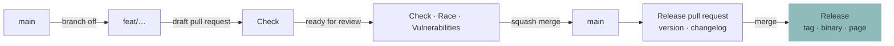

# Contributing

Oak is one binary and nothing else ships. `main` is the only branch that lasts: every change branches off it and comes back as one commit, and a release is one more pull request.

## Workflow


```mermaid
flowchart LR
    M["main"] -->|branch off| B["feat/…"]
    B -->|draft pull request| C["Check"]
    C -->|ready for review| D["Check · Race · Vulnerabilities"]
    D -->|squash merge| M2["main"]
    M2 --> P["Release pull request<br/>version · changelog"]
    P -->|merge| R["Release<br/>tag · binary · page"]

    style R fill:#8fbcbb,stroke:#8fbcbb,color:#2e3440
```

1. **Branch off `main`.** Name it after what it does: `feat/wireless-settings`, `fix/fuzzy-catalog`. Nothing reads the name
2. **Open a draft pull request right away.** A branch is checked through its pull request, never on its own
3. **Mark it ready for review** once it should be merged. That adds the race detector and the vulnerability scan
4. **Squash merge**, or switch on auto-merge. `main` takes the pull request once `Ready` and `Title` have passed, as one commit under its title, and deletes the branch

- The commits inside the branch are yours to shape. Only the title reaches `main`
- A draft never passes `Ready`, so nothing is merged before the full run
- A pull request that changes nothing but `CHANGELOG.md` or the release manifest starts no run and is never merged: both are the release pull request's

## The Title

The title is the one line `main` keeps. The next version and the changelog are read out of it, so it follows **[Conventional Commits](https://www.conventionalcommits.org)**: a type, a colon, what changed.

| Title | Version | On the Release Page |
| --- | --- | --- |
| `fix: a secret the machine already has is asked once` | 0.5.0 → 0.5.1 | Bug Fixes |
| `feat: a product may say where the rest of it is` | 0.5.0 → 0.6.0 | Features |
| `feat!: a module declares its hooks by folder` | 0.5.0 → 0.6.0 | ⚠ BREAKING CHANGES |
| `docs:` `refactor:` `test:` `build:` `ci:` `chore:` | none | nothing |

- Write it for somebody building a product. `Title` refuses one that opens on no type, and reads it again whenever it is edited
- Below 1.0.0 a break moves the minor rather than the major: 1.0.0 is a decision, not a count
- Merging shows the title and an empty description. Leave both as they are, with two exceptions typed into the description:
  - `BREAKING CHANGE: …` says on the release page what a product has to change
  - `Release-As: 1.0.0` sets a version that is chosen rather than counted

**Note:** _A title that turns out wrong after the merge is corrected in the description of the merged pull request. The next release run reads this instead of the commit:_

```
BEGIN_COMMIT_OVERRIDE
fix: the corrected line
END_COMMIT_OVERRIDE
```

## Releasing

Nothing is typed and nothing is tagged by hand.

1. **Every merge that releases something** opens or updates the pull request `chore(main): release 0.6.0`. It writes that version's section of **[CHANGELOG.md](../CHANGELOG.md)**
2. **Merging it is the release.** The run on `main` tags `v0.6.0`, builds `oak-linux-amd64` at that tag, hangs it on the release page and publishes it

- Merges collect in the release pull request until it is merged. When to release is a decision, not a schedule
- The binary answers `--version` with its tag, without the `v`, on the `runtime:` line. The last step before the download link refuses one that answers anything else, and `make build && make version-check TAG=v0.5.0` asks the same of a tag already out
- The changelog is never edited by hand

**Note:** _The page stays a draft until the binary hangs on it, so every link to the latest release points at the one before until then. A run that fails on the way leaves a draft: re-run its failed jobs._

**Note:** _The release pull request starts no run. The release run that wrote it reports `Ready` and `Title` on it, and its merge is checked on `main` before the tag exists. See **[ci.yml](../.github/workflows/ci.yml)**._

**Note:** _What each number promises a product is written down once, in the **[README](README.md#1-get-oak)**._

## What CI Runs

| Job | When | Does |
| --- | --- | --- |
| `Title` | a pull request opened, pushed to or edited | Reads the title |
| `Check` | a pull request, `main`, on demand | `make check`, and the binary answering for itself |
| `Race and vulnerabilities` | a pull request out of draft, `main`, on demand | The two checks that ask something outside the tree |
| `Ready` | a pull request | Every job it needed has passed, and it is no draft |
| `Release` | a push to `main` | The release pull request, or once that is merged, the tag and the draft page |
| `Publish` | a release | Builds `oak-linux-amd64` at that tag, hangs it on the page and publishes it |

**Note:** _The binary is built once the tag exists, because the version it answers to is that tag. Same sources the checks ran on, one commit and one version further on._

## Doing the Work

```
make check                     # the whole gate, as CI runs it
make fmt                       # format the Go and the shell
make run                       # Oak against the example product
make run MODULE=setup          # opens one module directly
make run ARGS=--debug          # ...without touching anything
make inspect                   # loads the example the way a run does
make build                     # bin/oak-linux-amd64, the file a release publishes
make test-race                 # the tests under the race detector
make vuln                      # known vulnerabilities in what this imports
make version-check TAG=v0.5.0  # would that tag be allowed to release this?
make locales                   # the template, and every catalog brought up to it
```

```
sudo pacman -S --needed go gcc make shellcheck shfmt staticcheck yamllint actionlint zizmor gettext govulncheck gitleaks
```

**Note:** _CI installs the same packages and runs the same commands in an Arch container. There is no second definition of green._

### The Boundary

Oak draws, asks, keeps and runs. It knows nothing about what is being installed.

If a change would put the word `pacman`, `btrfs`, `GNOME` or `LUKS` anywhere in this repository, it belongs in a product. Find the general capability a module is missing and add that instead.

**Note:** _Oak must not know a module by name either. `installer` and `recovery` are folder names in somebody's product, not words in this code._

## Translating

Every sentence Oak shows is translatable, and the English sentence is its own key. Reword one and the old translation is marked fuzzy rather than dropped; delete it and the translation goes with it.

```
make locales   # in the same change as anything added, reworded or deleted on screen
```

**Note:** _`make check` refuses a stale template and a translation that has lost a placeholder._

## Pictures in the Docs

Every image under `docs/` is generated, so none outlives the interface it shows.

```
make screenshots   # after any visible change to a page
make banner        # after the screenshots, the wordmark or the accent changed
make docs          # both, in that order
```

- They need `chromium`, `imagemagick`, `python-pyte` and `python-yaml`, none of which a build or `make check` needs
- Every run is started with `--debug` against the example, so nothing is built while it is photographed. Which pages are taken is **[screenshots.yaml](screenshots.yaml)**
- Every page comes out the same on every run except `run.png`, which catches the run while it is going

## The Repository

What GitHub holds this repository to is kept in **[.github/settings/](../.github/settings)** rather than clicked. An admin logged in with `gh` applies it:

```
make github
```

| File | Says |
| --- | --- |
| `repository.json` | Squash merges only, under the pull request's title alone; auto-merge on; a merged branch is deleted |
| `ruleset.json` | `main` takes nothing but a pull request, squashed, once `Ready` and `Title` have passed; no force push, no deletion |
| `actions.json` | A workflow's token reads unless it says otherwise, and may open the release pull request |
| `code-scanning.json` | CodeQL as GitHub sets it up by default: every language it finds, on pull requests, on `main` and weekly |

Run it again after changing one of them. Every call sets the whole state, so a second run changes nothing. The files and the script are the same in every project released this way.
