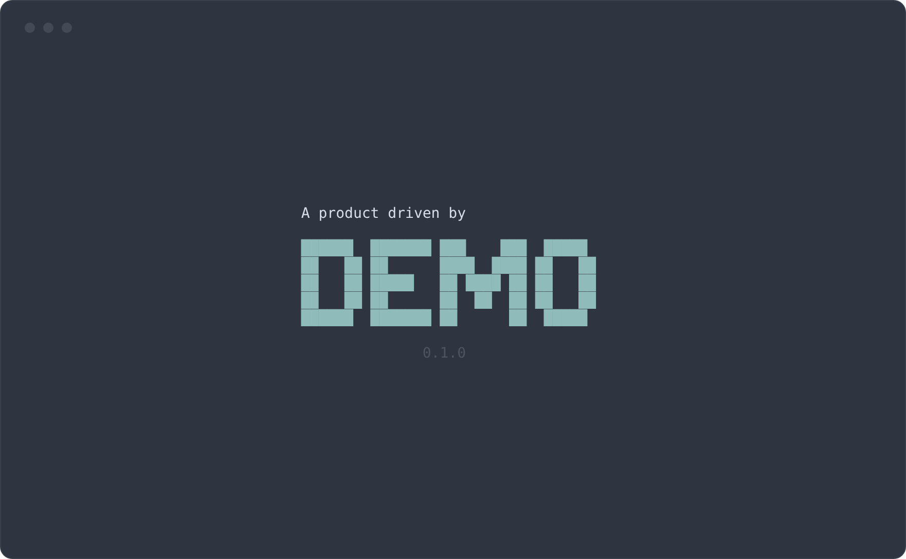
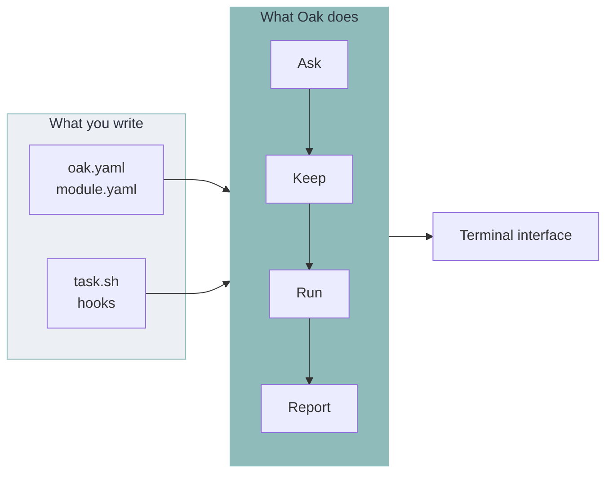
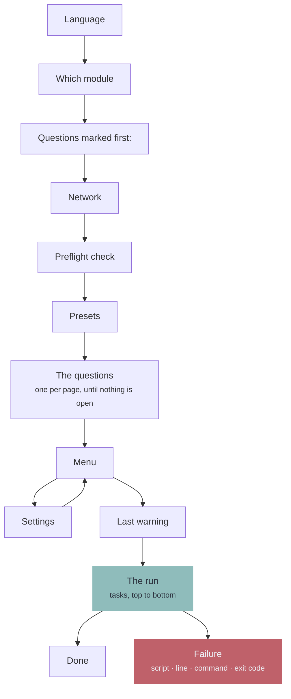
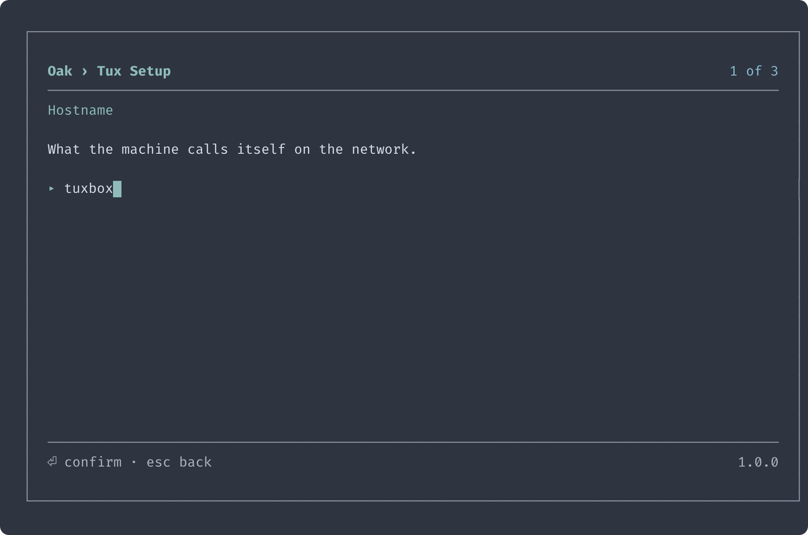
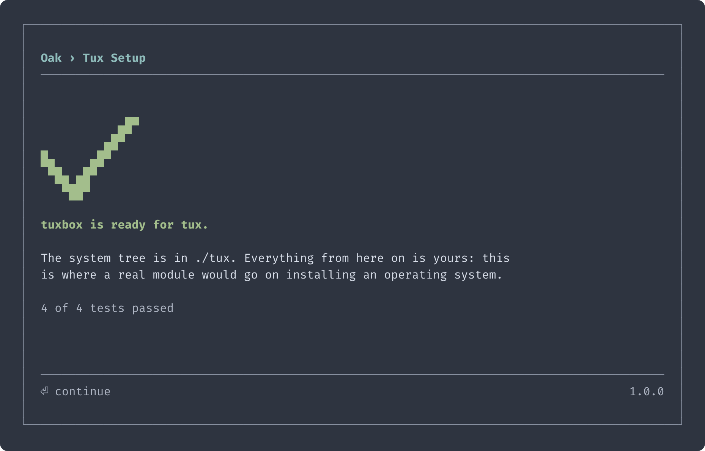
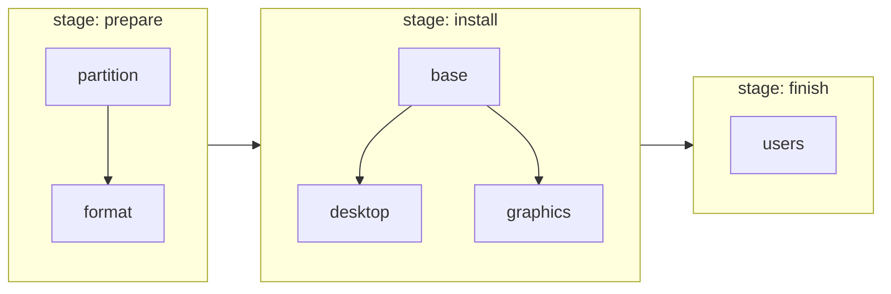
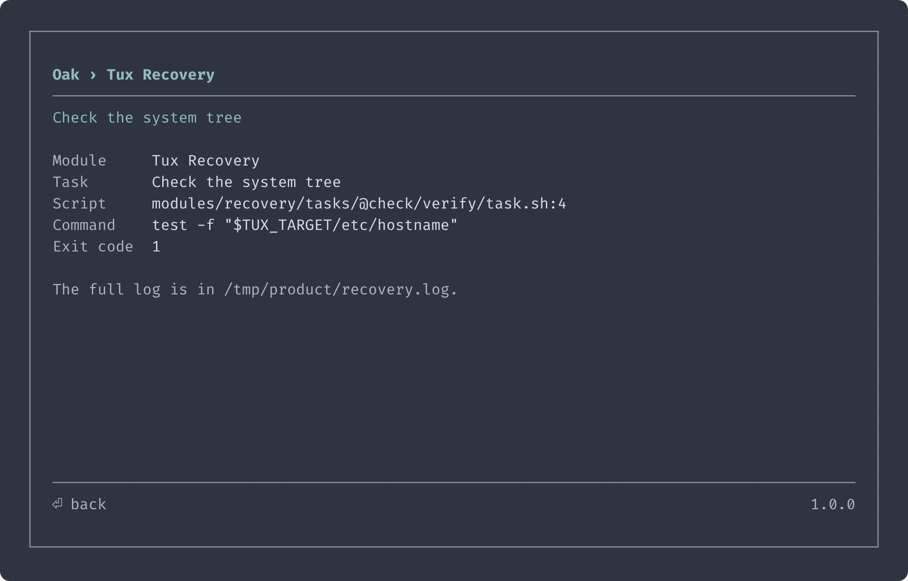

<div align="center">


<h1>Oak</h1>

<p><strong>An installer runtime. You write YAML and shell — Oak is the program around it.</strong></p>

<p>
  
  
  
</p>



</div>

Every installer is the same program twice: a menu, a set of questions, somewhere to keep the answers, a list of steps and a way to say which one broke. **Oak is that program, written once.** You supply the part that is actually yours — the questions, in YAML, and the work, in shell.

Oak knows nothing about any operating system. Not a disk, not a package, not a bootloader. That half stays in shell, where you can read it.

**[Arch OS](https://github.com/murkl/arch-os)** is a full Arch Linux installer built this way — a good place to see a real one.

## What you get

- **One config file per installer.** Questions, stages, the last warning before anything changes — all in one YAML file next to your scripts
- **A task pipeline.** A task is a folder with `task.yaml` and `task.sh`. The order comes out of what each task declares, so there is no list of steps to keep in step
- **Error handling you did not write.** A script that fails is caught, and the frame names the file, the line, the command and the exit code
- **Answers that survive.** Every answer is written down the moment it is given, as plain shell. An interrupted run picks up where it left off; copy the file to the next machine and every question it answers is skipped
- **Modular.** A module is one whole program. Ship an installer and a recovery from the same binary, or add a third by adding a folder
- **One file to ship.** A static binary, your YAML and your scripts beside it. Bash is the only thing it expects of the machine

## How it works

Oak looks next to itself, and nowhere else:

```
oak                       the binary
oak.yaml                  the product: name, colour, version, wordmark
modules/setup/            one module — everything below belongs to it
  setup.yaml              what it asks and what order it works in
  tasks/disk/task.yaml    where this step belongs
  tasks/disk/task.sh      what it does
  hooks/preflight.sh      optional: can this machine be worked on at all
  lib.sh                  optional: shell every script of this module gets
modules/recovery/         another module, another program
```

A **module** is one whole program. A **product** is the modules a binary ships with, under one name and one colour.



### A run, in order

Every page appears only when it has something to show. A module with no presets never shows a page offering none.



## Build one

### 1. Get Oak

```
curl -Lo oak https://github.com/murkl/oak/releases/latest/download/oak-linux-amd64
chmod +x oak
```

### 2. Say what the product is — `oak.yaml`

```yaml
title: Demo
version: 0.1.0
accent: "#8fbcbb"
```

### 3. Write a module — `modules/hello/hello.yaml`

```yaml
title: Demo Setup
description: Write a greeting to a file.
stages: [write]

variables:
  - name: DEMO_NAME
    title: Your name
    required: true
```

### 4. Add a task — `modules/hello/tasks/greet/`

`task.yaml` says where the step belongs:

```yaml
title: Write the greeting
stage: write
```

`task.sh` does the work. No shebang, no `set -e`, no error handling — Oak wraps it:

```bash
echo "Hello, ${DEMO_NAME}!" >./greeting.txt
```

### 5. Run it

```
./oak
```

Oak asks for a language, then for the one question that is required and still unanswered, then runs the task. A single module is opened on the way in rather than offered; a second folder under `modules/` is what turns that into a page. The answers land in `hello.conf`, everything the script printed in `hello.log`.

A working version of this is in **[example](../example)**.

<p align="center">
  
  
</p>

## The pipeline

Nothing lists the tasks anywhere. The folder is the list, and the order follows two rules:

- A task runs after every task of an **earlier stage**
- Inside its stage, it runs after whatever it named in **`needs:`**



A task with `conditions:` that do not hold is left out of the run entirely. Everything is checked when the module loads, so a renamed variable or a cycle is an error at startup — never a step that silently never fires.

## When a step breaks

The run stops and says where, in the words of the tool that failed. The rest is in the log.

<p align="center">
  
</p>

## The command line

Three options, and nothing else:

```
oak --module=hello     # open that module outright, instead of asking which
oak --debug            # hand every script DEBUG=true and touch nothing
oak --version          # print Oak's own version and exit
```

Nothing on the command line is an answer. Questions are answered in the interface.

## Built with Oak

**[Arch OS](https://github.com/murkl/arch-os)** — a reproducible Arch Linux installation: an installer and a recovery, both modules, on one bootable image.

## Everything else

**[➜ Reference](REFERENCE.md)** — the whole of what a product may declare: questions, presets, tasks, conditions, hooks, the script contract and translations.

**[➜ Contributing](CONTRIBUTING.md)** — how to work on Oak itself.

## License

GPL-3.0. See **[LICENSE](../LICENSE)**.

## Credits

- **[Bubble Tea](https://github.com/charmbracelet/bubbletea)** by charm
- **[gettext](https://www.gnu.org/software/gettext)**
