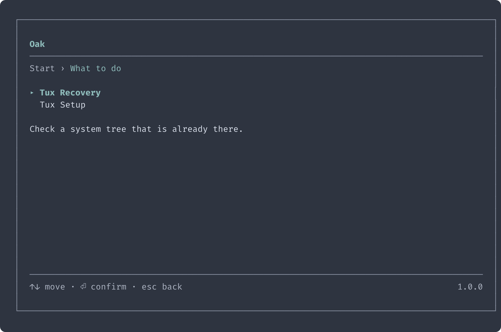
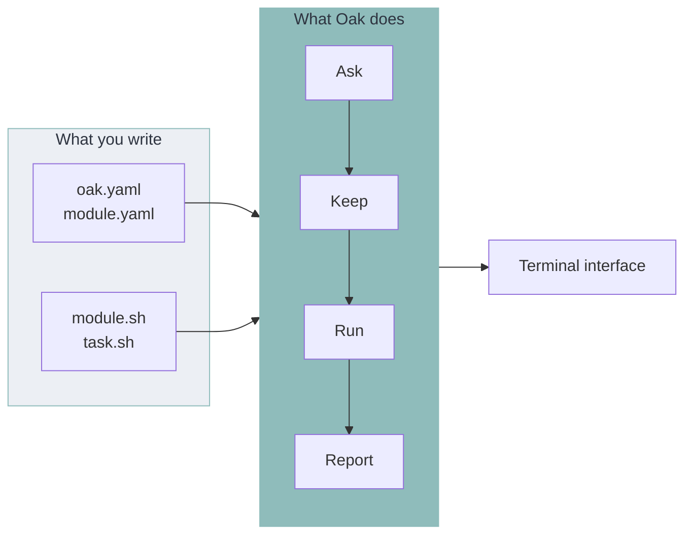
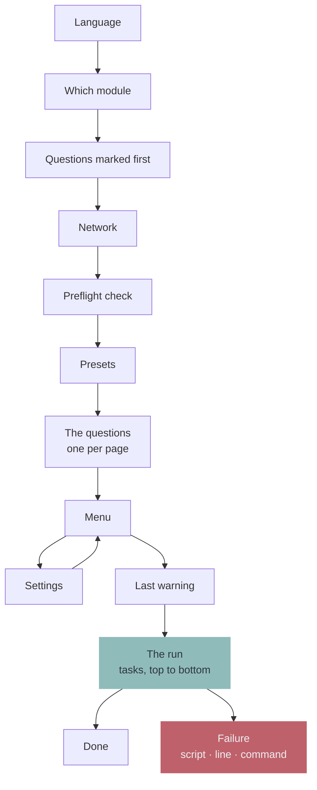
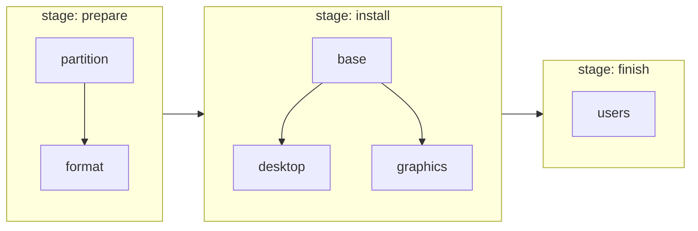
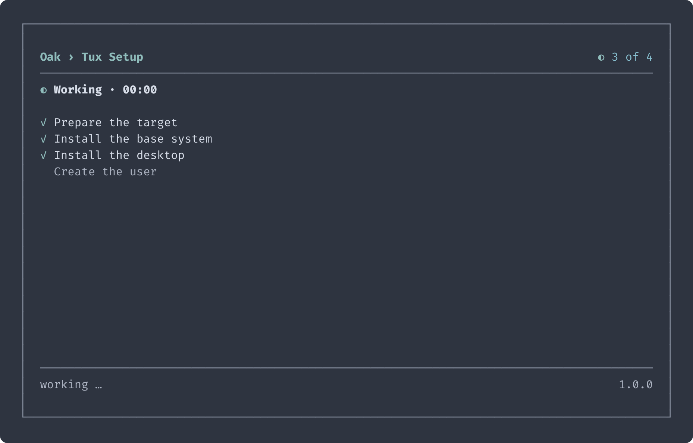

<div align="center">


<h1>Oak</h1>

<p><strong>An installer runtime for Linux. You write YAML and shell scripts — Oak is the program around it.</strong></p>

<p>
  
  
  
</p>


</div>

Every installer is the same program twice: a menu, a set of questions, somewhere to keep the answers, a list of steps and a way to say which one broke. **Oak is that program, written once.** You supply the part that is actually yours — the questions, in YAML, and the work, in shell.

Oak knows nothing about any operating system. Not a disk, not a package, not a bootloader. That half stays in shell, where you can read it.

**[Arch OS](https://github.com/murkl/arch-os)** is a full Arch Linux installer built this way — a good place to see a real one. The **[example](../example)** in this repository is a small one you can run in a minute: every screenshot below comes out of it.

## What you get

- **One config file per installer.** Questions, stages, the last warning before anything changes — all in one YAML file next to your scripts
- **A task pipeline.** A task is a folder holding a `task.yaml` and the shell it runs. The order comes out of the stage each task names and what it declares it needs, so there is no list of steps to keep in step
- **Error handling you did not write.** A script that fails is caught, and the frame names the module, the task, the file, the line, the command and the exit code
- **Checks that come with the steps.** A task may say how to tell that it took. Those run on the machine as the work goes, read and change nothing, and what they came to is one page at the end of the run
- **Answers that survive.** Every answer is written down the moment it is given, as plain shell. An interrupted run picks up where it left off; copy the file to the next machine and every question it answers is skipped
- **Modular.** A module is one whole program. Ship an installer and a recovery from the same binary, or add a third by adding a folder
- **One file to ship.** A static binary, your YAML and your scripts beside it. Bash is the only thing it expects of the machine

## How it works

Oak looks next to itself, and nowhere else:

```
oak                       the binary
oak.yaml                  the product: name, colour, version, wordmark
modules/setup/            one module — everything below belongs to it
  module.yaml             what it asks and what order it works in
  module.sh               optional: shell everything this module runs gets
  tasks/format/           one task: task.yaml, task.sh, and an optional test.sh
  hooks/@preflight/uefi/  optional: a hook — can this machine be worked on at all
modules/recovery/         another module, another program
```

A **module** is one whole program. A **product** is the modules a binary ships with, under one name and one colour. One folder under `modules/` is opened on the way in; a second is what turns that into a page.

<p align="center">
  
</p>



### A run, in order

Every page appears only when it has something to show. A module with no presets never shows a page offering none.



## Build one

### 1. Get Oak

```
curl -Lo oak https://github.com/murkl/oak/releases/latest/download/oak-linux-amd64
chmod +x oak
```

`latest` is whatever is newest. A product that releases versions of its own pins the Oak it was built against instead — `releases/download/v1.0.0/oak-linux-amd64` — so the same tag builds the same thing twice. Which one drove it is under the wordmark on the way in: `powered by oak v1.0.0`.

### 2. Say what the product is — `oak.yaml`

```yaml
title: Tux Linux
version: 1.0.0
accent: "#8fbcbb"
```

### 3. Write a module — `modules/setup/module.yaml`

```yaml
title: Tux Setup
description: Set a machine up for Tux.
stages: [install]

variables:
  - name: TUX_HOST
    title: Hostname
    description: What the machine calls itself on the network.
    required: true
```

### 4. Add a task — `modules/setup/tasks/hostname/`

`task.yaml` says what the step is and which phase it belongs to:

```yaml
title: Write the hostname
stage: install
```

`task.sh` beside it does the work. No shebang, no `set -e`, no error handling — Oak wraps it:

```bash
mkdir -p ./tux/etc
echo "$TUX_HOST" >./tux/etc/hostname
```

A step short enough to read at a glance skips the file and says it in the yaml instead:

```yaml
title: Write the hostname
stage: install
execute: |
  mkdir -p ./tux/etc
  echo "$TUX_HOST" >./tux/etc/hostname

# Optional: how to tell that it took. Reads the machine, changes nothing.
test: grep -q "^$TUX_HOST$" ./tux/etc/hostname
```

### 5. Run it

```
./oak
```

Oak asks for a language, then for the one question that is required and still unanswered, then runs the task. The answers land in `setup.conf`, everything the script printed in `setup.log`.

The **[example](../example)** is the same shape, filled out: two modules, three stages, a task that only runs under a condition, checks beside the work, and a page the run stops on when it is done.

<p align="center">
  
  
</p>

## The pipeline

Nothing lists the tasks anywhere. The folder is the list, and the order follows two rules:

- A task runs after every task of an **earlier stage**, which is the one its `stage:` names
- Inside its stage, it runs after whatever it named in **`needs:`**



<p align="center">
  
</p>

A task with `conditions:` that do not hold is left out of the run entirely. Everything is checked when the module loads, so a renamed variable or a cycle is an error at startup — never a step that silently never fires.

## When a step breaks

The run stops and says where, in the words of the tool that failed: which module, which task, which file and line, which command. The rest is in the log.

<p align="center">
  
</p>

A check that disagrees is not that. The work said it worked, so the run carries on and every check is read once, on the page it ends with — how many of how many, and each disagreement opening on the same report. One switch in the settings turns the whole of it off.

## The command line

Five options, and nothing else. Three are about a run:

```
oak --module=setup     # open that module outright, instead of asking which
oak --debug            # hand every script DEBUG=true and touch nothing
oak --version          # print Oak's own version — `oak v1.0.0` — and exit
```

Two are about the folder, for whoever is writing one. They print and draw nothing:

```
oak --inspect          # load the product the way a run does, and report what it holds
oak --strings          # write a module's translation template
```

Nothing on the command line is an answer. Questions are answered in the interface.

## Built with Oak

**[Arch OS](https://github.com/murkl/arch-os)** — a reproducible Arch Linux installation: an installer and a recovery, both modules, on one bootable image.

## Everything else

**[➜ Reference](REFERENCE.md)** — the whole of what a product may declare: questions, presets, tasks, checks, conditions, hooks, the script contract and translations.

**[➜ Contributing](CONTRIBUTING.md)** — how to work on Oak itself.

## License

GPL-3.0. See **[LICENSE](../LICENSE)**.

## Credits

- **[Bubble Tea](https://github.com/charmbracelet/bubbletea)** by charm
- **[gettext](https://www.gnu.org/software/gettext)**
