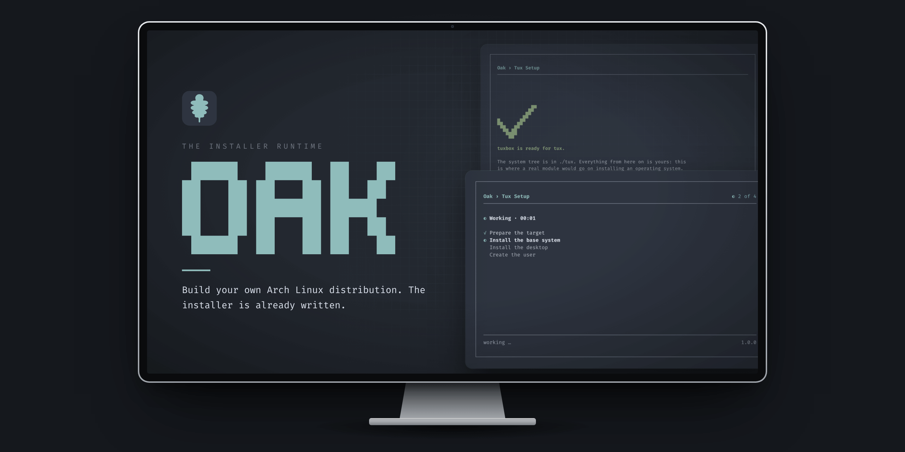
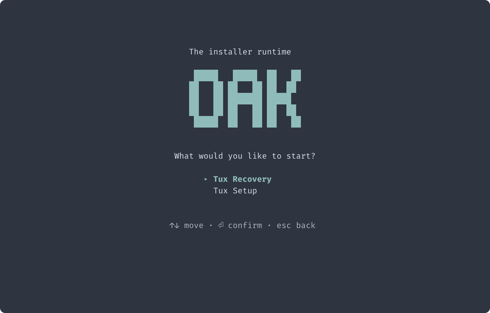
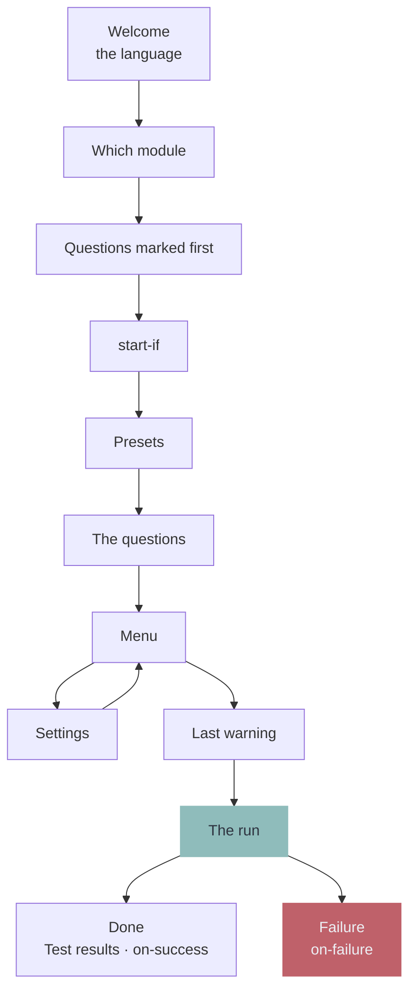
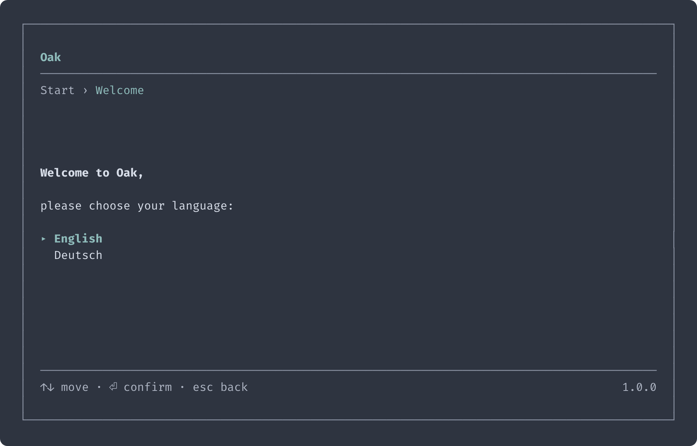
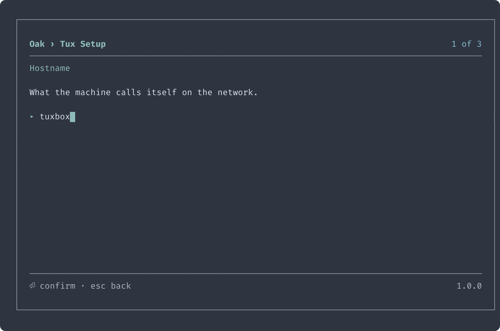
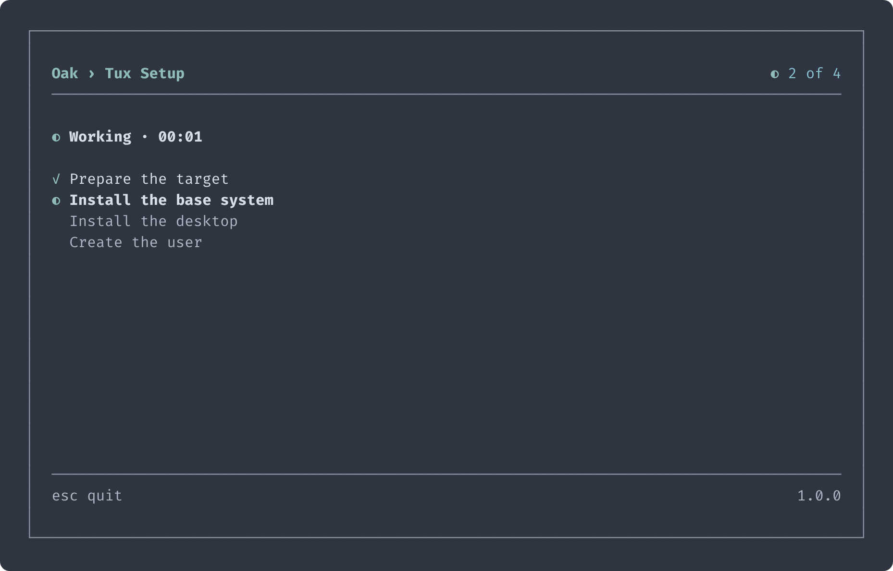
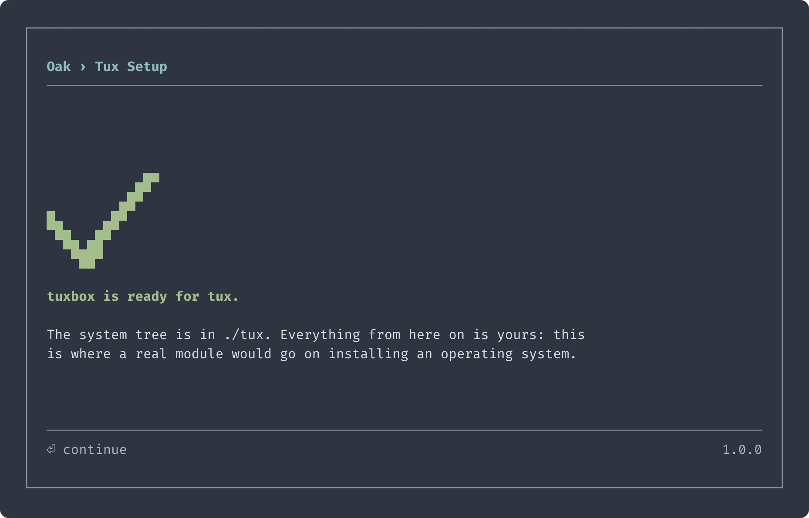
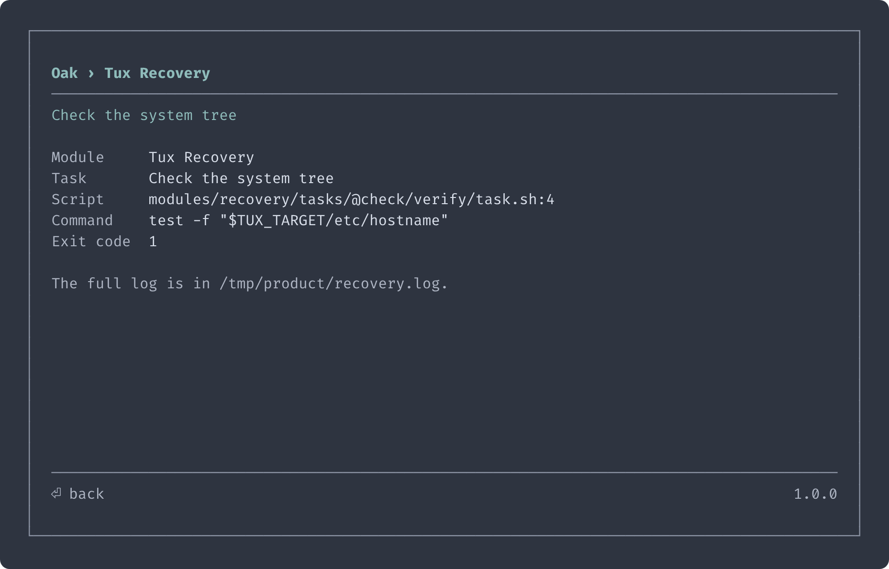

<div align="center">



<p>
  
  
  
</p>

</div>

<p align="center"><b>Build your own Arch Linux distribution. The installer is already written.</b></p>

You write the questions in YAML and the steps in shell. Oak turns them into an installer on the terminal: languages, starting points, a settings page, progress and error reports. It knows nothing about your system: no disk, no package, no boot loader.

**[Arch OS](https://github.com/murkl/arch-os)** is a complete distribution built this way. The **[example](../example)** is a small one you can run in a minute, and every screenshot below comes out of it.

## Features

- **One YAML per module.** Questions, stages, rules
- **A task pipeline.** A task is a folder. Its stage and its `needs` are the order
- **Error reports you did not write.** Module, task, file, line, command, exit code
- **Tests beside the steps.** Read the machine after each task, counted at the end and listed under **Test results**
- **Answers that survive.** Written down as plain shell as they are given
- **Modular.** An installer and a recovery from one binary, a third is a folder
- **One file to ship.** A static binary. Bash is all it expects of the machine

## How It Works

```
oak                       the binary
oak.yaml                  the product: name, colour, version, wordmark
oak.sh                    optional: the library every script gets
modules/setup/            one module
  module.yaml             what it asks, the order it works in, its rules
  tasks/@prepare/format/  one task, in the folder of its stage
  actions/wifi/           optional: one action, run where a rule names it
modules/recovery/         another module
```

<p align="center">
  
</p>


```mermaid
flowchart TD
    L["Welcome<br/>the language"] --> W["Which module"] --> Q1["Questions marked first"]
    Q1 --> N["start-if"] --> PR["Presets"]
    PR --> Q["The questions"]
    Q --> H["Menu"]
    H --> SE["Settings"] --> H
    H --> CF["Last warning"] --> R["The run"]
    R --> OK["Done<br/>Test results · on-success"]
    R --> ER["Failure<br/>on-failure"]

    style ER fill:#bf616a,stroke:#bf616a,color:#eceff4
    style R fill:#8fbcbb,stroke:#8fbcbb,color:#2e3440
```

## Build One

### 1. Get Oak

```
curl -LO https://github.com/murkl/oak/releases/latest/download/oak-linux-amd64
gh attestation verify oak-linux-amd64 --repo murkl/oak
install -m755 oak-linux-amd64 oak
```

**Note:** _A product pins the Oak it was built against: `releases/download/vX.Y.Z/oak-linux-amd64`. A new key is a minor version, anything that stops a product loading a major one. Below 1.0.0 a break moves the minor._

### 2. The Product: `oak.yaml`

```yaml
title: Tux Linux
version: 1.0.0
accent: "#8fbcbb"
```

### 3. A Module: `modules/setup/module.yaml`

```yaml
title: Tux Setup
description: Set a machine up for Tux.
stages: [install]

variables:
  - name: TUX_HOST
    title: Hostname
    required: true
```

### 4. A Task: `modules/setup/tasks/@install/hostname/`

`task.yaml` says what it is:

```yaml
title: Write the hostname
```

`task.sh` does it. No shebang, no `set -e`, no error handling:

```bash
mkdir -p ./tux/etc
echo "$TUX_HOST" >./tux/etc/hostname
```

`test.sh`, optional, reads whether it took:

```bash
grep -q "^$TUX_HOST$" ./tux/etc/hostname
```

### 5. Run It

```
./oak
```

The answers land in `setup.conf`, everything the scripts printed in `setup.log`.

<p align="center">
  
  
</p>

## The Pipeline

- A task runs after every task of an earlier stage
- Within its stage, after what it names in `needs`
- A task whose `conditions` do not hold is left out of the run

<p align="center">
  
  
</p>

## When a Step Breaks

The run stops and says where: module, task, file, line, command, what the tool said.

<p align="center">
  
</p>

A failed test and a failed `allow-failure` task do not stop the run. They are counted, and the finished run lists them under **Test results**.

## The Command Line

```
oak --module=setup     # open that module outright
oak --language=de      # read it in German, without the welcome page
oak --debug            # show the run, start nothing
oak --kiosk            # the machine is only this: leaving starts it over
oak --version          # Oak's own release
oak --inspect          # load the product as a run does, and report
oak --strings          # a module's translation template
oak --glyphs           # every character the interface draws on a console
```

## More

**[➜ Reference](REFERENCE.md)** · **[➜ Changelog](../CHANGELOG.md)** · **[➜ Contributing](CONTRIBUTING.md)**

## License

GPL-3.0. See **[LICENSE](../LICENSE)**.

## Credits

- **[Bubble Tea](https://github.com/charmbracelet/bubbletea)** by charm
- **[gettext](https://www.gnu.org/software/gettext)**
