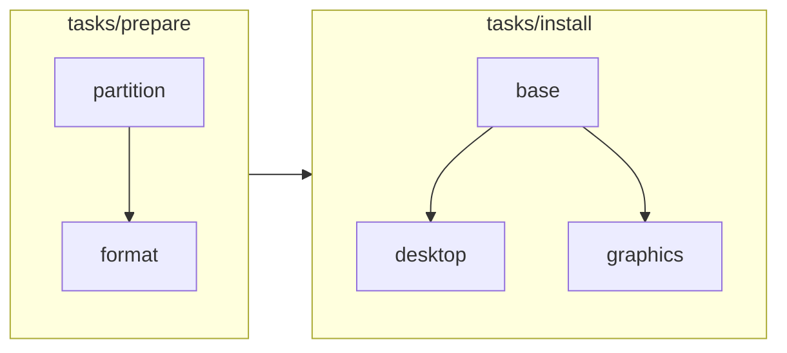

# Reference

Everything a product may declare. Nothing here is compiled into Oak: a different `oak.yaml` with a different set of modules beside it is a different program out of the same binary.

Two rules run through the whole file:

- **`title:` is what a person reads. `name:` only ever names a variable.** A module, a task and a preset are named by their folder or their place, so none carries an id
- **Nothing is written down twice.** Which modules there are is the folders under `modules/`; which stages have work in them and which tasks are in each is the folders under `tasks/`

## The product — `oak.yaml`

Sits beside the binary and holds what no module can answer for its neighbours. Every key is optional.

```yaml
title: Tux Linux
version: 1.0.0
accent: "#8fbcbb"
logo: |
  A product driven by

  ████████ ██    ██ ██   ██
```

| Key | Description |
| --- | --- |
| `title` | The product's name, over the pages drawn before a module is opened |
| `version` | What this build of the product is called, in the corner of every page. Left out, no version is shown |
| `accent` | `#rrggbb`. The one colour the interface is built from |
| `logo` | The wordmark. Everything above the first blank line is a dim eyebrow over it |

`version` is the product's own. Oak's own is what `--version` answers — `oak-1.0.0`, name and version as one word, the way a release names its files — and what the splash signs off with under the wordmark. It is never shown as though it belonged to the product.

## A module

One folder. Only the declaration has to be there — a module turns a part of the program off by leaving a file out.

| Path | Description |
| --- | --- |
| `module.yaml` | The declaration: what the module is, what it asks, and the order its work happens in |
| `module.sh` | Sourced in front of everything this module runs |
| `tasks/<stage>/<task>/task.yaml` | What a step is |
| `tasks/<stage>/<task>/task.sh` | What it does, where its yaml does not say so itself |
| `tasks/@<stage>/<task>/` | A stage Oak runs itself — see [System stages](#system-stages) |
| `locales/<code>.po` | One catalog per language |

The folder name is the module's identity: what `oak --module=<name>` opens, and what its files are called — `setup` writes `setup.conf` and `setup.log`. Everything inside it has the name Oak knows it by, so nothing points at anything.

### The declaration

```yaml
title: Tux Setup                         # the module's name on screen
description: Set a machine up for Tux.   # shown where the modules are offered
stages: [prepare, install]               # the phases the work happens in, in order
                                         # — one folder each under tasks/

confirm: |                               # the last thing shown before anything changes
  {{TUX_HOST}} will be set up in {{TUX_TARGET}}.

console: Run ./oak --module=setup to start it again.  # optional: read on the way out
language: TUX_LOCALE                     # optional: ties the interface language to one answer
```

| Key | Description |
| --- | --- |
| `title` | **Required.** The module's only name — it heads the row that starts a run, the last warning, and the clock while it runs |
| `stages` | **Required.** The phases the work happens in, in order. Each is a folder under `tasks/`, and a name may not start with `@` |
| `description` | One sentence, read on the page that offers the modules |
| `confirm` | The last thing shown before the first task. `{{VAR}}` is filled in from the answers |
| `console` | Read on the terminal on the way out, where the machine keeps running |
| `language` | Names a variable whose answer also settles the interface language. `de_DE` is matched to German |
| `presets` | See [Presets](#presets) |
| `variables` | See [Questions](#questions) |

## Questions

One entry under `variables:` is one question and one environment variable.

```yaml
variables:
  - name: TUX_HOST
    title: Hostname
    description: What the machine calls itself on the network.
    group: System
    required: true
    pattern: '^[a-z][a-z0-9-]*$'
    error: Lower case letters, digits and - only.
```

What is drawn follows from the declaration — there is no switch for it:

| Declaration | What is drawn |
| --- | --- |
| nothing further | A text box |
| `values: [btrfs, ext4]` | A list |
| `command: timedatectl list-timezones` | A list, built from what the command printed |
| `type: bool` | Yes / No, in the interface's language |
| `type: secret` | A password field, asked twice, never written to disk |

| Field | Description |
| --- | --- |
| `name` | **Required.** The environment variable a script reads |
| `title` | **Required.** The question |
| `description` | What this value is for, read above the question |
| `group` | The heading this row and the ones after it sit under, on the settings page |
| `required` | Required and unanswered is what makes Oak ask |
| `default` | The answer to start from. Any scalar: `true`, `8`, `pc105` |
| `prefill` | Shell that prints a suggestion into the box. A suggestion is not an answer, so it does not stop Oak asking |
| `apply` | Shell run when the answer takes effect — see below |
| `first` | Asked before everything else — see below |
| `free` | Label of a text box under a list, for a value the list only suggests |
| `pattern` | A regular expression the answer has to match |
| `error` | What a wrong answer is told. Left out, Oak names the rule that was broken |
| `conditions` | See [Conditions](#conditions) |

`true` and `false` are shown as Yes and No wherever they appear, so `values: [auto, true, false]` is a boolean with a third option.

**A secret** is the one required value that does not hold up the rest of the program. It is asked for immediately before the run that needs it, used, and forgotten — never written to the answer file or the log.

**`apply:`** is for an answer that changes the machine the program is running on rather than the one being worked on — `apply: loadkeys "$TUX_KEYMAP"`. It runs the moment the answer is given, and again at startup for an answer this run already had. A failure is logged as a warning and the answer still stands.

**`first: true`** puts a question before the network screen, the preflight and the presets, so a password can be typed on a keyboard layout that has already been settled. Use it sparingly: it is asked before the check that decides whether this machine can be worked on at all.

**A `command:`** may return a value and its display text on one line, separated by a **tab**. Everything before the tab is stored, everything after it is shown:

```bash
lsblk -dn -o PATH,SIZE,MODEL | awk '{printf "%s\t%s  %s %s\n", $1, $1, $2, $3}'
# /dev/nvme0n1<TAB>/dev/nvme0n1  1.8T WD Black
```

An empty value before the tab is a real answer ("no variant", "the default"), not a blank line to be dropped.

## Conditions

One condition, or a list where every one must hold:

```yaml
conditions:
  - TUX_DESKTOP != none
  - TUX_DRIVER == nvidia
```

`VAR == value` and `VAR != value`, and nothing else. Deliberately not an expression language: the two forms cover every guard an installer needs, and they are checked against the declared variables when the module loads — so a renamed variable is an error at startup rather than a task that silently never runs.

There is no `or`. A row that applies under two unrelated conditions is written as two rows.

## Tasks

A folder under the stage it belongs to: `tasks/<stage>/<task>/`. Nothing says which stage it runs in — the folder it sits in does.

```yaml
title: Install the graphics driver   # the line shown while the user waits
needs: [desktop-gnome]               # ordered after these, within the same stage
conditions:                          # every one must hold, or the task is skipped
  - TUX_DRIVER != none
```

What it does is the `task.sh` beside that file, or the `script:` in it:

```yaml
title: Enable 32-bit support
script: |                            # shell, for a step short enough to read here
  sed -i '/\[multilib\]/,+1s/^#//' /etc/pacman.conf
  pacman -Sy --noconfirm
```

| Written as | What runs |
| --- | --- |
| nothing | The `task.sh` in the same folder |
| `script:` with shell in it | That shell |
| `script: ./install.sh` | That file, relative to this `task.yaml` |

A `script:` **and** a `task.sh` is two answers to the same question and is refused, as is neither. Shell written in the yaml has no file for a failure to point at, so what a failure names is the command and the exit code rather than a file and a line.

Seven more keys change what a task **is** rather than what it does:

| Key | Description |
| --- | --- |
| `asks: VAR` | The run pauses to ask for that value first, for something not knowable before the work started. The variable must have a fixed set of answers and must not be a secret |
| `confirm:` | Asked as a yes/no before it runs. Declining skips it and the run carries on |
| `default: no` | That yes/no opens on No instead of Yes |
| `report:` | The run stops on a page of its own once this task has finished. The first paragraph is the headline; `{{VAR}}` is filled in |
| `shows: VAR` | Puts that answer on the report page as a scannable code, and under it as text |
| `quits: true` | The program does not return after this task — a reboot |
| `tty: true` | The interface steps aside and hands the script the whole terminal |

`shows:` is for a value meant to be used on a different machine than the one displaying it. It is read back from the answer file after the task has run, which is also how the task puts it there:

```bash
printf "MY_LINK='%s'\n" "$url" >>"$MODULE_CONF"
```

### The order

```
tasks/
  prepare/
    partition/
    format/          needs: [partition]
  install/
    base/
    desktop/         needs: [base]
    graphics/        needs: [base]
```



- A task runs after every task of an earlier stage
- Within its stage, it runs after whatever it named in `needs:`

Two tasks that neither a stage nor a `needs` separates are independent. Their order is stable from run to run, but it is not something to build on — the folder name is the task's identity, not a way to steer the order.

`needs:` names a task **in the same stage**. A name no task anywhere answers to is refused at startup, and so is a cycle, which is reported as the ring it goes round: `a → b → c → a`. A name belonging to another stage says nothing the stages have not already said, so it is dropped with a warning rather than refused — `--inspect` reports it and the log records it.

A folder under `tasks/` that is neither a declared stage nor one of Oak's own is refused: work that never runs because its folder is misspelled is the one mistake nothing else would ever show.

## Presets

Pages of starting points, offered once on a machine that has answered nothing yet. A preset is a set of answers, not a mode: every value it sets can still be changed afterwards.

```yaml
presets:
  - title: Setup
    description: What kind of system to install.
    options:
      - title: Desktop
        description: A full desktop.
        values:
          TUX_DESKTOP: gnome

      - title: Online                  # a starting point fetched rather than written out
        description: Take the answers somebody shared.
        asks: TUX_CONFIG_SOURCE        # the one question this row asks
        apply: ./tasks/finish/share/import.sh   # shell turning that answer into more answers
```

A preset is named by its title and nothing else. Nothing points at one, so there is no id to keep unique.

## System stages

Seven stages belong to Oak rather than to the module, and are marked with `@` so a listing tells them apart at a glance. Each is a folder of tasks like any other stage — Oak decides when it runs, and a module that leaves one out simply does not get that part of the program.

| Stage | Description |
| --- | --- |
| `@preflight` | Can this machine be worked on at all. A hard stop, run before everything except the `first` questions. What it writes to stderr is what the user reads |
| `@online` | Is there internet. Without it the network screen never appears |
| `@wlan-device` | Which wireless device to use |
| `@wlan-networks` | The networks in range, one SSID per line |
| `@wlan-connect` | Join one, with `WLAN_DEVICE`, `WLAN_SSID` and `WLAN_PASSPHRASE` in the environment |
| `@restart` | Shut this machine down and start it again |
| `@shutdown` | Switch it off |

```
tasks/@preflight/root/task.yaml       title: Running as root
tasks/@preflight/firmware/task.yaml   title: UEFI, Secure Boot off
tasks/@online/https/task.yaml         title: Reach the network
```

Every task in one of them runs in order, and `@preflight` stops at the first that says no — so a check that is really four checks is written as four, each with a name of its own. `needs:` orders them the way it orders any stage.

A task here is written like any other — a `title:`, what it `needs:`, and its `task.sh` or `script:` — but it is run at a fixed moment rather than listed, offered or reported on, so `conditions:`, `asks:`, `confirm:`, `default:`, `report:`, `shows:`, `quits:` and `tty:` are refused: a line that can never take effect is a line somebody will read as though it could.

The title of a `@preflight` task is read: it is what the failure page names when that check is the one that said no. Everywhere else it is what the file calls itself, and nothing more.

`@restart` and `@shutdown` turn leaving the interface into a choice rather than a plain exit: a module that fills them is saying the machine booted specifically to run it. A module with neither exits like any ordinary program.

## What a script receives

Every declared variable under its own name, answered or not, and two names of Oak's own:

| Variable | Description |
| --- | --- |
| `MODULE_CONF` | The answer file. Also how a script answers a question back: append `KEY='value'` to it |
| `DEBUG` | `true` when the run was started with `--debug`. Absent otherwise |

That is the whole list, and it is meant to stay that way. Anything else a script needs it works out for itself — its own folder, for instance, is where `module.sh` was sourced from:

```bash
MODULE_DIR="$(cd "$(dirname "${BASH_SOURCE[0]}")" && pwd)"
```

Scripts run in a shell that already carries an `ERR` trap and, where the module has one, `module.sh`. They need no preamble: no shebang, no `set -e`, no error handling. If a command fails, the task fails and the user is shown the file, the line, the command and the exit code.

**`module.sh` is sourced in front of everything** — every task, and every piece of shell the yaml writes for a `command:`, a `prefill:`, an `apply:` or a `script:`. So a function defined there is called by name from the yaml:

```yaml
apply: load_console_keyboard
command: list_locales
```

```yaml
# tasks/@online/https/task.yaml
title: Reach the network
script: is_online
```

Four rules, and no more:

- **Change nothing while simulating.** `simulating && return 0` before the first line that touches anything, with `simulating()` defined in your `module.sh` as `[ "$DEBUG" = true ]`
- **Never end on a command that can fail.** `[ "$X" = y ] && do_it` as the last line leaves the script's status at 1 when the test is false
- **Ask nothing.** Every question is declared in the yaml, unless the task declares `tty: true`
- **Print nothing for a person to read.** stdout and stderr go to the log; the screen shows the task's name

`command:`, `prefill:`, `apply:` and a task's `script:` each accept either shell or a file. A single line starting with `./` or `../` names a file, relative to the folder of the yaml it was written in; anything else is the shell itself.

## Files it writes

Beside wherever the program was started, never inside a module — which may be a read-only medium:

| File | Description |
| --- | --- |
| `oak.conf` | What Oak keeps across every module: the language |
| `<module>.conf` | Every answer, as `KEY='value'`. Plain shell, editable by hand |
| `<module>.log` | Oak's own progress plus every line every script printed |

A second module writes its own pair beside the first, so two started from the same folder never collide.

## Keys

Five keys, three meanings, the same on every page. Long lists narrow with `/`.

| Key | Meaning |
| --- | --- |
| `enter` | Confirm |
| `esc`, `backspace` | Back |
| `q`, `ctrl+c` | Ask to leave |

**Note:** _Arrow keys only move a cursor, since an arrow key is also what a mouse wheel sends._

## Checking a product

Two options that answer on stdout instead of drawing anything. They read the product beside the binary, the same one a run would open, and `--module=` narrows both to one of its modules:

```
oak --inspect                    # load the product beside the binary, and report
oak --inspect --module=setup     # just that one module
oak --strings --module=setup     # write that module's translation template
```

`--inspect` loads a product exactly as a run does — every task ordered, every condition resolved — and prints what it found. **This is the check to put in a build script.** Two of its lines are about the gap between the yaml and the shell, in opposite directions:

| Line | Meaning |
| --- | --- |
| `unread` | A question asked where no task that reads the answer can run. **This fails the check** — it is the one authoring mistake a module's shape does not rule out on its own |
| `unset` | A name in capitals the module's shell reads that nothing here answers. A description, not a verdict — `$HOME` and `$PATH` belong on that line |
| `needs` | A `needs:` naming a task in another stage. Also a description: the stages already put the two in that order |

`unset` is where a name that used to arrive and no longer does becomes visible. In shell an unset name is an empty string rather than an error, so nothing else would ever say so.

## Translations

The source string is the key. A line of yaml says `Your name` and a catalog answers with `Dein Name`; a catalog with nothing to say about a string leaves the English standing, which is what makes a half-finished translation useful from its first line.

```
./oak --strings --module=setup > modules/setup/locales/setup.pot
cp modules/setup/locales/setup.pot modules/setup/locales/fr.po
```

Two catalogs are merged: Oak's own, compiled into the binary, and the module's under `locales/`. A catalog names its own language as the translation of `English`, and that is what the language picker lists — so a language is always shown in its own words.

The language is chosen on the first page of every run and can be changed in the settings. It opens on whatever `oak.conf` last recorded, or on whatever `LC_ALL`, `LC_MESSAGES` or `LANG` comes closest to. It never reaches a script: what a script does is the same in every language.

**Note:** _The Linux virtual console holds at most 512 glyphs. A product that runs there before any desktop exists is safe with ASCII and the Latin-1 letters, and not with Greek, Cyrillic or anything written in a script of its own._
