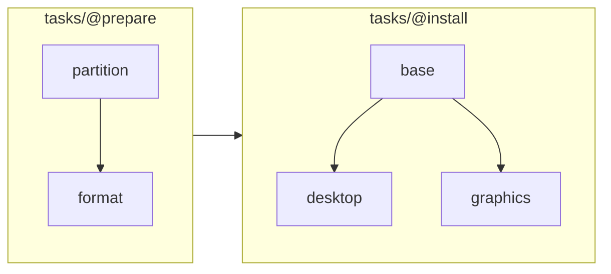

# Reference

Everything a product may declare. Nothing here is compiled into Oak: a different `oak.yaml` with a different set of modules beside it is a different program out of the same binary.

Two rules run through the whole file:

- **`title:` is what a person reads. `name:` only ever names a variable.** A module, a task and a preset are named by their folder or their place, so none carries an id
- **Nothing is written down twice.** Which modules there are is the folders under `modules/`; which tasks there are, and what phase each runs in, is the folders under `tasks/`

## The product — `oak.yaml`

Sits beside the binary and holds what no module can answer for its neighbours. Every key is optional.

```yaml
title: Tux Linux
version: 1.0.0
accent: "#8fbcbb"
logo: |
  A product driven by

  ████████ ██    ██ ██   ██
```

| Key | Description |
| --- | --- |
| `title` | The product's name, over every page — followed by the module's own once one is open |
| `version` | What this build of the product is called, in the corner of every page. Left out, no version is shown |
| `accent` | `#rrggbb`. The one colour the interface is built from |
| `logo` | The wordmark the run comes up out of, and the welcome page stands under. Everything above the first blank line is a dim eyebrow over it |
| `status` | What the header keeps an eye on while a module is open — see [The header's status](#the-headers-status) |

`version` is the product's own. Oak's own is what `--version` answers — `0.1.0`, the release and nothing beside it, so a build that pins Oak reads the line as it stands — and what the splash signs off with under the wordmark. It is never shown as though it belonged to the product.

### The header's status

One thing about the machine, opposite the name on every page of every module: shell run every so often, and the words it reads as while that shell says yes and while it says no.

```yaml
status:
  script: is_online      # shell or ./file, with oak.sh loaded: exit 0 is yes
  every: 10              # seconds between two runs. Left out, 10
  pass: Online           # what it reads while the script says yes
  fail: Offline          # ...and while it says no
```

The mark in front of it is Oak's, filled for yes and hollow for no, so it is one a console font holds wherever the interface can be drawn at all. Nothing is shown until the script has answered once, and the line gives way to whatever is happening now: the mark that turns while something runs takes its place, and so does a page's own count. Once an action has run, it is read again at once rather than an interval later, since what the action did may be what the line is about.

Written in `oak.yaml`, it is every module's. A module that writes `status:` in its own declaration has that one and none of the product's. `pass` and `fail` are read through the module's catalog, and `oak --strings` puts them in its template.

### The product's shell — `oak.sh`

Optional, beside `oak.yaml`, and **the one place scripts share code**. It is a library: loaded in front of every script of every module — see [What a script receives](#what-a-script-receives) — so a function two tasks, two actions or two modules would otherwise each carry a copy of is written once, and a yaml calls it by name. A value the scripts share is set with `export`, which says it is read somewhere else.

```bash
# oak.sh
export TUX_ROOT=/mnt

# The release file in whichever tree the answers point at.
tux_release() { printf '%s/etc/os-release' "$TUX_TARGET"; }
```

There is no second one. A module has no shell of its own, and an action belongs to the module that names it: a `module.sh` in a module and an `actions/` beside `oak.yaml` are both refused at load, with this file named as where their contents go. What only one task or one action needs stays in its folder.

## A module

One folder. Only the declaration has to be there — a module turns a part of the program off by leaving a file out.

| Path | Description |
| --- | --- |
| `module.yaml` | The declaration: what the module is, what it asks, and the order its work happens in |
| `tasks/@<stage>/<task>/task.yaml` | What a task is |
| `tasks/@<stage>/<task>/task.sh` | What it does |
| `tasks/@<stage>/<task>/test.sh` | How to tell that it took. Optional — see [Testing the work](#testing-the-work) |
| `actions/<action>/action.yaml` | A script run outside the work, wherever a rule names it — see [Actions](#actions) |
| `actions/<action>/action.sh` | What it does |
| `locales/<code>.po` | One catalog per language |

The work and the actions are two folders, not one, because they answer to different things: a task is the module's own work — listed, ordered, guarded — while an action runs wherever the module names it: before the work, from a row, to put right what another said no to. Every file inside says which of the two it is, so neither is ever read as the other.

The folder name is the module's identity: what `oak --module=<name>` opens, and what its files are called — `setup` writes `setup.conf` and `setup.log`. Everything inside it has the name Oak knows it by, so nothing points at anything.

### The declaration

```yaml
title: Tux Setup                         # the module's one name, wherever it is named
description: Set a machine up for Tux.   # shown under the row that starts the work
start-title: Install                     # optional: what starting the work is called
stages: [prepare, install]               # the phases the work happens in, in order
                                         # — each a folder under tasks/

language: TUX_LOCALE                     # optional: ties the interface language to one answer

rules:                                   # optional: when its actions run
  offer-if: [live-image]                 # offered on a machine these say yes on
  start-if: [root, internet]             # the work starts once these say yes
  menu: [wlan]                           # rows on the menu
  on-leave: [restart, shutdown]          # rows on the way out
  on-failure: [share-log]                # rows under a run that failed
  on-success: [shell]                    # rows under a run that finished
```

| Key | Description |
| --- | --- |
| `title` | **Required.** What the module is called, everywhere: the row that opens it, the trail across the top of every page once it is open, and every sentence the interface writes about it |
| `stages` | **Required.** The phases the work happens in, in order. Each is a folder under `tasks/`, marked — `tasks/@install/` — and the name written here carries no `@` of its own |
| `description` | One sentence, read on the menu under the row that starts the work |
| `start-title` | What starting the work is called: the first row of the menu, and the button on the last page before the run. Left out, `Start` |
| `language` | Names a variable whose answer also settles the interface language. `de_DE` is matched to German |
| `rules` | When its actions run, each rule a list of them — see [Actions](#actions), and for `offer-if` [Which modules a machine is offered](#which-modules-a-machine-is-offered) |
| `status` | This module's own line in the header, in place of the product's — see [The header's status](#the-headers-status) |
| `presets` | See [Presets](#presets) |
| `variables` | See [Questions](#questions) |

**One name, and a verb for pressing it.** The frame carries the title on every page, so the rows inside a module are named after what they do — `Start`, `Settings` — and the lines a run writes about itself say `Failed` rather than the module's name over again. A name read twice on one screen is a line that says nothing. `start-title:` is what the first of those rows does in the module's own word — `Install`, `Repair` — where `Start` says too little. It is a verb and not a second name: a module whose title already says what it does — `Write an image` — would only repeat it, and names a shorter verb, `Write`, or none.

### Placeholders

The texts a module writes for a moment are filled in from the answers: the `confirm:` and the `report:` of a task, and the `fail:` and the `report:` of an action. `{{TUX_DISK}}` is the answer to `TUX_DISK`, and nothing else is: this is not a template language, and it is deliberately not `$VAR`, which means something else entirely two lines away in the same folder.

A name is filled in with nothing where nothing answers it, because braces on screen at the moment somebody is reading carefully are worse than a short sentence. Which is why a name nothing answers is not allowed to get that far:

- **A module is refused** if either names a variable it does not declare. The typo is found where it was written.
- **`--inspect` fails** if a translation names other `{{VAR}}` than the string it came from. Which order they appear in is the translator's to choose — German moves them — but which ones appear is not, and a sentence that quietly stopped naming the disk reads exactly like a finished one.

### Which modules a machine is offered

`rules: offer-if` names actions, each run by itself, in order, and they are the only thing Oak runs before a module has been opened. They read the machine and nothing else — there are no answers yet — which is why they are shell rather than the `conditions:` a task is guarded with. A module that names none is on offer everywhere.

What is left is what the interface does with them:

| On offer | What happens |
| --- | --- |
| Several | The question after the language, under the wordmark the same way: which one to open |
| One | It is opened on the way in. No list of one row |
| None | The program says so and stops, in the words each module wrote |

An action answers with its exit status, and the `fail:` of the first to say no is the sentence somebody reads when they named that module outright with `--module=`. So a check that says no says why, in the module's own words, the way every action under `start-if` does — and in the language the interface is read in, since it is a string of the yaml rather than whatever the script printed.

```yaml
# modules/writer/module.yaml
rules:
  offer-if: [installed-system]
```

```yaml
# modules/writer/actions/installed-system/action.yaml
title: An installed system
fail: This writes a device from an installed system, not from the live image.
```

```bash
# modules/writer/actions/installed-system/action.sh
[ "$(cat /proc/sys/kernel/hostname)" != "archiso" ]
```

This is what lets one product hold modules that belong on different machines — an installer that only makes sense on a live image, and the thing that writes that image, which only makes sense anywhere else. Each says so itself, and nothing anywhere holds a list of which is which, so adding a module stays a folder.

**`--debug` offers every one of them.** A simulated run is read on whatever machine somebody happens to be sitting at, and a list narrowed to what that machine is would hide exactly the pages they opened it for.

## Questions

One entry under `variables:` is one question and one environment variable.

```yaml
variables:
  - name: TUX_HOST
    title: Hostname
    description: What the machine calls itself on the network.
    group: System
    required: true
    pattern: '^[a-z][a-z0-9-]*$'
    error: Lower case letters, digits and - only.
```

What is drawn follows from the declaration — there is no switch for it:

| Declaration | What is drawn |
| --- | --- |
| nothing further | A text box |
| `values: [btrfs, ext4]` | A list |
| `command: timedatectl list-timezones` | A list, built from what the command printed |
| `type: bool` | Yes / No, in the interface's language |
| `type: secret` | A password field, asked twice, never written to disk |
| `type: secret` with `existing: true` | The same field, asked once |

| Field | Description |
| --- | --- |
| `name` | **Required.** The environment variable a script reads |
| `title` | **Required.** The question |
| `description` | What this value is for, read above the question |
| `group` | The heading this row and the ones after it sit under, on the settings page |
| `required` | Required and unanswered is what makes Oak ask |
| `existing` | On a secret: the password already exists and is only being handed over, so it is asked once — see below |
| `check` | On a secret: shell that tries it before it is taken — see below |
| `default` | The answer to start from. Any scalar: `true`, `8`, `pc105` |
| `prefill` | Shell that prints a suggestion into the box. A suggestion is not an answer, so it does not stop Oak asking |
| `answer` | Shell that works the value out instead of asking for it — see below |
| `apply` | Shell run when the answer takes effect — see below |
| `first` | Asked before everything else — see below |
| `free` | Label of a text box under a list, for a value the list only suggests |
| `filter` | Whether the list carries its narrowing box open: `open` or `collapsed` — see below |
| `pattern` | A regular expression the answer has to match |
| `error` | What a wrong answer is told. Left out, Oak names the rule that was broken |
| `conditions` | See [Conditions](#conditions) |

`true` and `false` are shown as Yes and No wherever they appear, so `values: [auto, true, false]` is a boolean with a third option.

**A secret** is the one required value that does not hold up the rest of the program. It is asked for immediately before the run that needs it, used, and forgotten — never written to the answer file or the log, and never on the settings page: a row that can show nothing and open on nothing only raises the question of why not.

It is typed twice, because a password being **chosen** is checked by nothing: a typo in it is found at the first boot of a system that took twenty minutes to build, and four seconds against that is no trade. `existing: true` says this one is not being chosen but entered — the disk already has it — and asks once. Whatever it is handed to refuses a wrong one within seconds and says so, which is more than a second box can. On anything but a secret the key is refused.

```yaml
  - name: TUX_PASSWORD
    title: Encryption password
    type: secret
    existing: true                   # the disk has it already; asked once
    required: true
```

**`check:`** tries a secret on what it opens before it is taken — shell, or a file, run with the value under its own name like every answer a script is handed. A non-zero exit refuses it on the page it was typed on, under the module's `error:` or a sentence of Oak's own, and the box starts over; what the shell said goes to the log. So a typo costs a second go at the box rather than a run that stops halfway, on the step that needed the password. The mark in the header turns while it runs, since a wrong password is refused slowly on purpose. On anything but a secret the key is refused.

```yaml
  - name: TUX_PASSWORD
    title: Encryption password
    type: secret
    existing: true
    required: true
    check: printf '%s' "$TUX_PASSWORD" | cryptsetup open --test-passphrase --key-file=- /dev/sda2
    error: That is not the password of this disk.
```

**`answer:`** is for the question a machine can see the answer to: whether the disk in front of it is encrypted is a fact, not an opinion. The shell prints the value, and printing nothing leaves it empty.

```yaml
  - name: TUX_ENCRYPTED
    title: Encrypted
    type: bool
    answer: disk_is_encrypted          # a function in oak.sh
```

It is read when the module opens and again whenever an answer changes, so a value worked out from another answer follows it. Such a variable is **never asked, never on the settings page and never written to the answer file** — the next run reads it off the machine again, and a stored copy could only disagree with it. It is still an answer like any other everywhere else: scripts read it under its own name, and `conditions:` are written against it.

**Note:** _Where there is something to decide, there is a question. `answer:` is refused on a secret, alongside `prefill:` and together with `first:`._

**`apply:`** is for an answer that changes the machine the program is running on rather than the one being worked on — `apply: loadkeys "$TUX_KEYMAP"`. It runs the moment the answer is given, and again at startup for an answer this run already had. Where the answer was just given, a failure is logged as a warning and the answer still stands: whoever chose it is looking at what it did. At startup — and after a preset filled it in — the answer goes back to what it was before anybody answered, and is asked again: nobody watched it being put in force, and a password typed next on a keymap that never loaded is refused without a word about why.

**`first: true`** puts a question before everything the work waits for and before the presets, so a password can be typed on a keyboard layout that has already been settled. Use it sparingly: it is asked before the checks that decide whether this machine can be worked on at all.

**`filter:`** says what a question's list does with the narrowing box `/` opens. `collapsed` — every question that says nothing — leaves it behind the key, which costs the page nothing until somebody wants it. `open` puts it up from the first frame, for the list that has to be scrolled through to find a row. Nothing is counted on the machine: a list of keyboard variants is thirty rows here and three there, and a page that changed shape with that would be two pages. A question asked `first` carries its box open either way, and saying so again is refused.

**A `command:`** may return a value and its display text on one line, separated by a **tab**. Everything before the tab is stored, everything after it is shown:

```bash
lsblk -dn -o PATH,SIZE,MODEL | awk '{printf "%s\t%s  %s %s\n", $1, $1, $2, $3}'
# /dev/nvme0n1<TAB>/dev/nvme0n1  1.8T WD Black
```

An empty value before the tab is a real answer ("no variant", "the default"), not a blank line to be dropped.

**An answer from such a list is read against it once more** on the page the run is started from, because that is the last moment it can still be put again. A device name is a path, and what is at the path is whatever this machine has plugged in now; an answer file copied over from another machine, or edited by hand, names a disk or a keymap as it stood there. An answer the list no longer prints is asked again, with the module's `error:` — or a sentence of Oak's own — above a list that opens on the `prefill:`, and taken again as soon as the list prints it once more. A list that also takes a typed answer under `free:` is not read, since that answer is not supposed to be in it, and a list that cannot be read vouches neither way.

## Conditions

One condition, or a list where every one must hold:

```yaml
conditions:
  - TUX_DESKTOP != none
  - TUX_DRIVER == nvidia
```

`VAR == value` and `VAR != value`, and nothing else. Deliberately not an expression language: the two forms cover every guard an installer needs, and they are checked against the declared variables when the module loads — so a renamed variable is an error at startup rather than a task that silently never runs.

There is no `or`. A row that applies under two unrelated conditions is written as two rows.

## Tasks

One folder under the stage it runs in: `tasks/@<stage>/<task>/`. The stage folders are the phases `module.yaml` listed, marked with `@` — the mark says the folder is a **when**, and the folder inside it a **what**.

```
tasks/
  @prepare/
    partition/
  @install/
    base/
    desktop/
```

```yaml
title: Install the graphics driver   # the line shown while the user waits
needs: [desktop-gnome]               # ordered after these, within the same stage
conditions:                          # every one must hold, or the task is skipped
  - TUX_DRIVER != none
```

The task folder's name is its identity — what another task's `needs:` points at — and the stage folder above it is when it runs. Moving a task to another phase is moving the folder, and nothing inside it can say one thing while it sits in another.

What it does is the `task.sh` beside its yaml — always a file, so a failure has a line to point at and the linter has something to read. A folder without one is refused.

Six more keys change what a task **is** rather than what it does:

| Key | Description |
| --- | --- |
| `asks: VAR` | The run pauses to ask for that value first, for something not knowable before the work started. The variable must have a fixed set of answers and must not be a secret. A list that comes back **empty** is a task with nothing to do, and the **whole task** is skipped, so work that has to happen either way sits in a task of its own ahead of the question; a command that **fails** stops the run |
| `confirm:` | Asked as a yes/no before it runs, opening on Yes. Declining skips it and the run carries on |
| `report:` | The run stops on a page of its own once this task has finished. The first paragraph is the headline; `{{VAR}}` is filled in — see [Placeholders](#placeholders). Where anything has been tested, the page also says how many passed, and where an optional task failed, how many did |
| `progress: true` | The last line the script drew is shown, dimmed, under its name while it runs — see below |
| `simulates: true` | Run under `--debug` as well, test and all, because the task reads `DEBUG` itself — see [Simulating](#simulating) |
| `optional: true` | The result stands without it: a failure does not stop the run — see below |

What a module offers once the work is done — a shell in the new system, a restart, a configuration to share — is not a task but an action under `rules: on-success`: a row on the page the run ends on, chosen or not — see [Actions](#actions).

**`progress: true`** is for the task nobody can guess the length of and whose output is a bar rather than chatter — an image of several gigabytes arriving over a home connection. Everything any other task prints goes to the log and nowhere else. Here the one line it drew last, on either channel, is shown under its name: a bar redrawn in place counts as the line it was redrawn to, colour is stripped, a line wider than the page loses its start rather than the percentage at its end, and the line is gone as soon as the task is.

**`optional: true`** is for work that hangs on something outside the machine — a download from a service that may be down — and that nothing after it builds on. Where it fails, its row keeps a cross, its test and its report are left out, and the run goes on with the next task. It still counts: every page the run stops on says how many optional tasks failed, and the list after it opens each one on the same file-and-line report a failed test gets — see [Testing the work](#testing-the-work). A task that everything after it needs is not optional, and saying so would only move the failure to wherever the missing work is first missed.

### Testing the work

A task may also say how to tell that it took: a `test.sh` beside its `task.sh`. It is **optional**: a task without one is simply never tested.

```bash
# tasks/@boot/loader/test.sh
arch-chroot "$MNT" bootctl is-installed | grep -q yes
```

It runs immediately after the work, on the machine that work was done to, and it has one rule: **it reads and it says nothing else**. It runs on a system halfway through being built, and a test that changes anything is a step nobody listed. What it prints goes to the log.

Its exit status is the answer, the same way a task's own is: a command that failed, or whatever it handed back at the end.

A script can say no without any command having failed — `return 1` and a guard that does not fire both look like that, and the trap sees neither — and the report still names the line: what comes back then is the last line the script itself was on. A command that really did fail is named where that command is, which for a function out of `oak.sh` is the line inside `oak.sh`.

A run started with `--debug` starts a test only where its task declares `simulates: true` — see [Simulating](#simulating).

A test that fails does not fail the run. The work said it worked, and something looking at the machine afterwards disagreed — that is a thing to read, not a reason to abandon an installation that is already on the disk.

So the tally is read where somebody is actually looking: on every page a `report:` stops the run on, and again under the line that says the run is over. A run whose last offer is a restart is a run most people never see the end of, which is why it is not only said there.

Where something disagreed, the next page is the list of what did — offered **once**, at the first of those stops, and not at all where everything passed. An optional task that failed is on the same list, ahead of the tests. Choosing a row opens the same file-and-line report a failed task gets: the module, the task, the file and line in its `test.sh`, the command and what the tool said. Leaving the list carries the run on into whatever it was going to offer next.

Both of those pages are left **only by saying so**: the list by choosing the row at the end of it, the report behind it by pressing enter. Esc and backspace do nothing on either. Everywhere else in the program a page that is only read answers to them as well, because leaving it costs nothing — here it costs the only account of what went wrong this run is going to give, and reaching for the key that means back is exactly what somebody does who has just been told something failed.

Whether any of this happens at all is one switch in the settings, on unless somebody turns it off. It is Oak's own answer rather than a module's — what a task tests is the module's business, whether anything is tested is not — so it is kept in `oak.conf` and holds for every module beside it. The switch is offered only where the module has something to test, and it stands at the foot of the page with the row that forgets every answer: neither is a value, both are about the run.

### The order

```
tasks/
  @prepare/
    partition/
    format/        needs: [partition]
  @install/
    base/
    desktop/       needs: [base]
    graphics/      needs: [base]
```


```mermaid
flowchart LR
    subgraph A["tasks/@prepare"]
        direction TB
        P["partition"] --> F["format"]
    end
    subgraph B["tasks/@install"]
        direction TB
        BS["base"] --> DE["desktop"]
        BS --> GR["graphics"]
    end
    A --> B
```

- A task runs after every task of an earlier stage
- Within its stage, it runs after whatever it named in `needs:`

Two tasks that neither a stage nor a `needs` separates are independent. Their order is stable from run to run, but it is not something to build on — the folder name is the task's identity, not a way to steer the order.

`needs:` names a task **in the same stage**. A name no task anywhere answers to is refused at startup, and so is a cycle, which is reported as the ring it goes round: `a → b → c → a`. A name belonging to another stage says nothing the stages have not already said, so it is dropped with a warning rather than refused — `--inspect` reports it and the log records it.

A folder under `tasks/` whose name is not a declared stage is refused, and so is a task lying straight under `tasks/` with no stage folder over it: work that never runs because a stage is misspelled is the one mistake nothing else would ever show.

## Presets

Starting points, offered once on a machine that has answered nothing yet, as the rows of one page. The page is Oak's own — its heading and the sentence under it are the same for every module — so a module writes only the rows. A preset is a set of answers, not a mode: every value it sets can still be changed afterwards.

```yaml
presets:
  - title: Desktop
    description: A full desktop.
    values:
      TUX_DESKTOP: gnome

  - title: Online                      # a starting point fetched rather than written out
    description: Take the answers somebody shared.
    action: import                     # the action that fetches them — see Actions
```

A preset is named by its title and nothing else. Nothing points at one, so there is no id to keep unique.

A preset either writes its answers out under `values:` or names the action that fetches them under `action:` — never both. The action's page asks for whatever the answers are fetched by, its script writes them into the answer file, and once it has worked they are read back over the answers held, put in force, and the opening goes on exactly as it would have after a written-out one.

## Actions

A script a module runs outside its work. Each is a folder under the module's `actions/`, holding an `action.yaml` and an `action.sh`. What two actions share — the same row in two modules, say — is a function in [`oak.sh`](#the-products-shell--oaksh) that both scripts call. **The yaml says how it behaves, and the script only does the work:** exit 0 is yes, anything else is no, and what happens on either is written in the yaml. Oak knows nothing about what any of them is for: joining a wireless network, switching the machine off and checking that it booted the right way are all actions a module wrote.

An action does not say where it runs. A rule names it, by its folder — every rule is under `rules:`, in `module.yaml` or in another action's `action.yaml`:

| Rule | What happens there |
| --- | --- |
| `offer-if` in `module.yaml` | Run by itself before the module is opened: whether it is on offer on this machine — see [Which modules a machine is offered](#which-modules-a-machine-is-offered) |
| `start-if` in `module.yaml` | Run by itself before the work begins, in order. The first that says no stands a page in front of everything — see below |
| `menu` in `module.yaml` | A row on the menu, between the row that starts the work and Settings |
| `on-leave` in `module.yaml` | A row on the page every way out arrives at |
| `on-failure` in `module.yaml` | A row under the report of a run that failed |
| `on-success` in `module.yaml` | A row under a run that finished — what is offered once the work is done |
| `offer-if` in `action.yaml` | Run by itself before this action is offered anywhere: a row this machine cannot use is not shown |
| `on-failure` in `action.yaml` | One action, opened where this one says no, to put right what it found |

A preset's `action:` is the one name outside `rules:`: opened when that starting point is chosen — see [Presets](#presets).

The same word means the same thing in both files: `offer-if` is what has to say yes before the module or the action is offered at all, and `on-failure` is what is offered once the run or the action said no.

**An action has at most one page:** a question before its script, its report after it, or the terminal handed to it. A flow of several pages is several actions, each opened on the failure of the one before — which is also how a step that is not always needed is left out: the network is joined as it is chosen, and only where that says no is the passphrase asked for.

```yaml
# actions/internet/action.yaml — named under start-if
title: Internet
fail: There is no internet connection. Plug in a cable, or join a wireless network.
rules:
  on-failure: wlan
```

```bash
# actions/internet/action.sh
is_online
```

```yaml
# actions/wlan/action.yaml — named under menu, and on the failure above
title: Wireless network
description: Join a wireless network.
rules:
  offer-if: [wireless-card]
  on-failure: wlan-passphrase            # the network wants one
variable:                                # its one page
  name: WLAN_SSID
  title: Network
  command: ./networks.sh
```

```yaml
# actions/wlan-passphrase/action.yaml — opened on the failure of the one above
title: Wireless network
fail: "{{WLAN_SSID}} did not accept that passphrase."
variable:
  name: WLAN_PASSPHRASE
  title: Passphrase
  type: secret
  existing: true
```

| Key | Description |
| --- | --- |
| `title` | **Required.** Its row, the heading over its page, and what the page says while it runs |
| `description` | The sentence under its row |
| `rules` | `offer-if`: the actions that must say yes before this one is offered at all. `on-failure`: the one action opened where this one says no |
| `fail` | What a no means, in the module's words: the page in front of the work, the reason a module is not offered, the headline over a failure. **Required** on an action named under `offer-if` or `start-if` |
| `variable` | Its one page before it runs: a question with the fields a module's own have, bar `first`, `group` and `answer` |
| `report`, `shows` | Its one page after it has run, and an answer drawn there as a code. Being named is that answer's whole declaration: the script writes it into the answer file, the way any script answers |
| `tty` | Its one page is the terminal: the interface steps aside and hands the script all of it |
| `simulates` | Run under `--debug` as well — see [Simulating](#simulating) |

**Run by itself** — named under `offer-if` or `start-if` — an action is a question, and shows no page. **Opened** — from a row, a starting point or on another's failure — it asks its page where it has one, then runs its script with the answer in the environment under its own name. Esc goes back a page. Once the script has worked, the pages go and the page it was opened from is back — after its report, where it has one — and the header's status is read again. Where it did not work and its `on-failure` is an action this machine has, that is opened on top, so esc from its page goes back along the chain. Where it has none, the page every failure opens on says so, under its `fail:`, with the file, the line and what the script said, and the way back is to the last page: the next thing to try is another go at the answer. An answer is the session's alone: never on the settings page and never in the answer file, and a secret is forgotten as soon as the script has run.

The terminal is handed over **outright**: all three channels are the terminal itself, whatever Oak's own were pointed at — a service on a console has its stderr in the journal, and a shell draws its prompt on stderr. The script gets a foreground process group of its own on it, so an interactive shell does its job control there, and Oak takes the terminal back when the script exits. A shell inside another system is therefore one line: `arch-chroot /mnt || true`.

**What the work starts if** is asked after the questions marked `first` and before the presets. The first that says no stands a page in front of everything: its `fail:` is that page, and what the script printed goes to the log. It asks again by itself every few seconds and carries on the moment it says yes, so a cable plugged in needs no key, and `r` asks at once. Where its `on-failure` is an action this machine has, enter opens that, and the page asks again once it has worked. One with nothing to open is a check of the machine, and the page is the whole of it.

**What an action is offered if** is asked when the module opens and again every time the menu comes up, since what it asks about is a thing that gets plugged in. Until it has answered, the row is not shown: a row that would be taken away again is worse than one that lands a moment late.

What cannot take effect is refused when the module loads: a name that is no action, an action nothing names, an action opened on its own failure, actions whose `offer-if` and `on-failure` go round in a ring, more than one page, a page on an action run by itself, a check under `offer-if` or `start-if` without a `fail:`, a page asked `first`, in a `group` or worked out with `answer:`, and an action under `on-leave` with a question, since a way out asks nothing. A page shares the module's names, so it may not be called what one of its questions is.

**`on-leave`** turns leaving the interface into a choice rather than a plain exit: a module that names actions there is saying the machine booted specifically to run it. Its rows come first, then the runtime's own **Exit**, which closes the program and leaves the machine running. A module that names none exits like any ordinary program.

**`on-failure`** and **`on-success`** put rows under the end of a run — the report of one that failed, the result of one that finished — above the one that goes on from there. The list opens on that last row: an action is chosen on purpose, and an enter meant for the page before runs nothing. Sharing the log of a failed run is the one to put under `on-failure`, with the address it was put at drawn as a code; the log is `<module>.log` beside the answer file — see [Files it writes](#files-it-writes). Under `on-success` stands what is offered once the work is done: a shell in what was built, the answers shared for the next machine.

**`oak --kiosk`** is for a machine that is nothing but this program, which is the machine's business rather than the module's: the same recovery can be one choice of several on a live image and the only thing a small partition boots into. There is no console behind a kiosk, so the row that would return to one is **Reset** instead: every answer is forgotten and the program closes, for whatever keeps it running to start it again — a systemd unit with `Restart=always`. A new process is the one start that owes nothing to the run before it. Every module offers that row in a kiosk, so leaving always asks, even where the module names nothing on the way out.

## What a script receives

Every declared variable under its own name, answered or not, and two names of Oak's own:

| Variable | Description |
| --- | --- |
| `MODULE_CONF` | The answer file. Also how a script answers a question back: append `KEY='value'` to it |
| `DEBUG` | `true` when the run was started with `--debug`. Absent otherwise — see [Simulating](#simulating) |

That is the whole list, and it is meant to stay that way. Anything else a script needs it works out for itself — its own folder, for instance:

```bash
here="$(cd "$(dirname "${BASH_SOURCE[0]}")" && pwd)"
```

Scripts run in a shell that already carries an `ERR` trap and, where there is one, `oak.sh`. They need no preamble: no shebang, no `set -e`, no error handling. **Any non-zero status is a failure** — a command that failed anywhere in the script, or whatever the script itself hands back at the end. If one fails, the unit fails, the run stops there, and the page it stops on is the one a finished run stops on under the other mark. Behind it is the module, the unit, the file, the line, the command, the exit code and what the tool said — the same page every failure in the program opens on.

**`oak.sh` is sourced in front of everything** — every task, every test, every action, and every piece of shell the yaml writes for a question's `command:`, `prefill:`, `apply:`, `answer:` or `check:` and the header's status `script:`. So a function defined there is called by name from the yaml:

```yaml
apply: load_console_keyboard
command: list_locales
```

The work itself is always a file — `task.sh`, `test.sh`, `action.sh` — in the folder of what it belongs to. What only one task or one action needs stays there, beside its yaml, and `oak.sh` holds only what several of them would otherwise each carry a copy of.

It is **loaded, not run**. A lookup in it that tries one thing and falls back to another is ordinary shell and is nobody's failure, so it is sourced outside the trap: what it recovers from is never reported as the failure of the unit that was about to run. The one thing that is its own failure is a shell that will not load at all, and that fails the unit with whatever it said on the way out.

Three rules, and no more:

- **Never end on a command that can fail unless you mean it.** A script answers with its exit status, so `[ "$X" = y ] && do_it` as the last line fails it when the test is false. End on the real work, on an `if` block or on an `echo` — and where you do mean it, `exit 1` and `return 1` both say so
- **Ask nothing.** Every question is declared in the yaml, unless an action declares `tty: true`
- **Print nothing for a person to read.** stdout and stderr go to the log; the screen shows the task's name

A `test.sh` keeps all three and adds a fourth: **change nothing at all**. It reads a machine somebody is still installing onto, and its exit code is the whole of what it has to say.

### Simulating

`--debug` shows a run without doing it. **No task, no test and no action is started**: a task is shown running for a moment and marked done, its `report:` still stops the run, an action comes back as though it had worked, and the pages look as they would. Every module and every action is offered and nothing under `start-if` is asked: a simulated run is read on whatever machine somebody happens to be sitting at, which is not the one those actions are about. So a script needs no guard against it.

What still runs is what reads rather than acts — the shell a question is offered, suggested, applied and worked out with, an action's page among them. It is handed `DEBUG=true` and decides for itself; an `apply:` that loads a keyboard, for one, has no business doing so on somebody's own machine.

A task or an action that has something worth showing and can produce it without touching anything declares `simulates: true`. It is then started like any other, a task's test with it, and reads `DEBUG` to decide what a simulated run does — one that only reads, or one that fills in the value its report shows with an example.

`command:`, `prefill:`, `apply:`, `answer:`, `check:` and the status `script:` each accept either shell or a file. A single line starting with `./` or `../` names a file, relative to the folder of the yaml it was written in; anything else is the shell itself.

## Files it writes

Beside wherever the program was started, never inside a module — which may be a read-only medium:

| File | Description |
| --- | --- |
| `oak.conf` | What Oak keeps across every module: `OAK_LANG`, the language, and `OAK_VALIDATE`, whether a run checks its own work |
| `<module>.conf` | Every answer, as `KEY='value'`. Plain shell, editable by hand. A secret, a derived answer and an action's answers are not in it. Written out whole when a run starts, so a task that copies it hands on exactly what the run ran with |
| `<module>.log` | Oak's own progress plus every line every script printed |

A second module writes its own pair beside the first, so two started from the same folder never collide.

**The last row of the settings page deletes the answer file.** Every answer is forgotten and the module opens again where a machine that has answered nothing opens it — the starting points included, since being offered once is the whole of what one is. It is asked first and opens on No, because nothing about it can be taken back. The log is left standing: it says what this machine did, and forgetting the answers does not unwrite the disk they were carried out on.

## Keys

Five keys, three meanings, the same on every page. Long lists narrow with `/`.

| Key | Meaning |
| --- | --- |
| `enter` | Confirm |
| `esc` | Back, everywhere |
| `backspace` | Back, except in front of a box being typed into, where it is the delete key |
| `q`, `ctrl+c` | Ask to leave |

**Note:** _Arrow keys only move a cursor, since an arrow key is also what a mouse wheel sends._

**Note:** _A question whose answers have to be scrolled through declares its narrowing box open with `filter: open`, and it is then up from the first frame instead of behind `/`. In front of any box being typed into, `q` and backspace are characters rather than keys; `esc` and `ctrl+c` never are._

**Note:** _Backspace never leaves a text box, a password or a narrowing box, however empty it is. A key repeat is faster than a hand, and a box cleared by holding it down would leave the page on the very next repeat — which is why no hint anywhere names backspace, and every one of them names esc._

## Checking a product

Three options that answer on stdout instead of drawing anything. The first two read the product beside the binary, the same one a run would open, and `--module=` narrows them to one of its modules. `--glyphs` is about the binary alone:

```
oak --inspect                    # load the product beside the binary, and report
oak --inspect --module=setup     # just that one module
oak --strings --module=setup     # write that module's translation template
oak --glyphs                     # every character the interface can put on a console
```

`--inspect` loads a product exactly as a run does — every task ordered, every condition resolved — and prints what it found. **This is the check to put in a build script.** Three of its lines are about the gap between the yaml and what reads it, in different directions:

| Line | Meaning |
| --- | --- |
| `unread` | A question asked where no task that reads the answer can run. **This fails the check** — it is the one authoring mistake a module's shape does not rule out on its own |
| `unset` | A name in capitals the module's shell reads that nothing here answers. What `oak.sh` reads is answered where any module of the product declares it. A description, not a verdict — `$HOME` and `$PATH` belong on that line |
| `needs` | A `needs:` naming a task in another stage. Also a description: the stages already put the two in that order |
| `translation drops` / `adds` | A catalog naming other `{{VAR}}` than the string it translates. **This fails the check** — see [Placeholders](#placeholders) |

`unset` is where a name that used to arrive and no longer does becomes visible. In shell an unset name is an empty string rather than an error, so nothing else would ever say so.

## Translations

The source string is the key. A line of yaml says `Your name` and a catalog answers with `Dein Name`; a catalog with nothing to say about a string leaves the English standing, which is what makes a half-finished translation useful from its first line.

```
./oak --strings --module=setup > modules/setup/locales/setup.pot
cp modules/setup/locales/setup.pot modules/setup/locales/fr.po
```

Two catalogs are merged: Oak's own, compiled into the binary, and the module's under `locales/`. A catalog names its own language as the translation of `English`, and that is what the language picker lists — so a language is always shown in its own words.

The language is chosen on the welcome page every run opens on, and can be changed in the settings afterwards. The page stands on its own rather than in the frame: the wordmark stays where the splash left it, a module named on the command line — or the only one there is — stands under it, and choosing a language is what opens the frame. Where there are several modules, the question of which to open comes next and stands under the wordmark the same way — read in the language just chosen, each module offered by its title alone — and choosing one is what opens the frame instead: the frame is titled after the module, and before one is chosen there is nothing for it to be about. It opens on whatever `oak.conf` last recorded, or on whatever `LC_ALL`, `LC_MESSAGES` or `LANG` comes closest to. It never reaches a script: what a script does is the same in every language.

`oak --language=de` names it on the command line instead, and the welcome page is not drawn at all: its one question is answered. It is matched the way a locale is, so `de_DE.UTF-8` is German too, and a language no catalog answers to is refused before anything is drawn. It is recorded in `oak.conf` the way a choice made on that page is, so whatever reads that file afterwards reads the language the run was read in.

**Note:** _The welcome page itself is the one page no catalog is read for. It is drawn before a language has been settled, so it stays in plain English whatever the last run chose._

**Note:** _The Linux virtual console holds at most 512 glyphs. A product that runs there before any desktop exists is safe with ASCII and the Latin-1 letters, and not with Greek, Cyrillic or anything written in a script of its own._

**Note:** _Which 512 is the font's choice, so a product that boots to a console loads one that holds what the interface draws. `oak --glyphs` prints every character outside ASCII it can put there — the rules, the marks, the three cells every picture is built from, and its own words in every language it ships — so a build holds the font to that line rather than to a copy of it. `kbd`'s own `default8x16` holds all of it; every Terminus holds the full block and neither half of it, which is exactly what a code and the mark over a finished run are drawn from. A 256-glyph font also keeps the sixteen background colours a code needs its white from — a 512-glyph one spends that bit on the glyph index._
